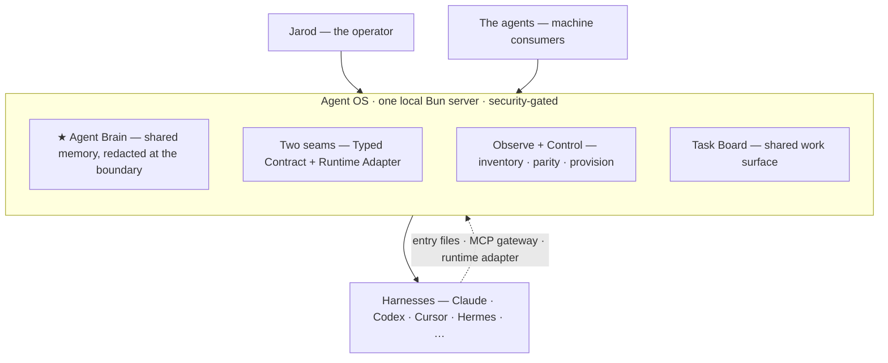

# Agent OS

**A local-first control plane and shared brain for a team of AI agents — so they work as one.**

I run a dozen AI harnesses — Claude Code, Codex, Cursor, Hermes, and more — each powerful on its own but walled off from the others. They share no memory, so I re-explain my ways-of-working to every one and each starts cold. There's no shared surface, so work can't be tracked or evaluated across them. And juggling that many terminals is its own cognitive tax, so I collapse back to a single agent and lose the team. The crux: **my agents are a team that can't act like one, because nothing connects them.**

**Agent OS is the connective tissue.** A thin control plane plus a shared brain that every harness plugs into — so the agents act as one co-located team while each keeps its own best-in-class harness. The hard rule that makes this a choice and not a wish: *I never build or fork my own agent harness.* **Connect, don't compete.**

> [!NOTE]
> This is a personal project, built in the open — a reference and a journey, **not** a supported or installable product. The parts worth reading are the [architecture](docs/ARCHITECTURE.md) and the [decision log](docs/DECISIONS.md), where every choice is recorded with its *why*.

## What it does — four tracks

- **★ The Agent Brain** *(the wedge — the piece I most want)* — shared memory across every agent. I dump raw input; the agents curate, relate, dedup, and resurface it at the right moment. It's **agent-legible and MCP-native**, so any harness reads and writes it directly, without me relaying by hand.
- **Observe + Control** — see and *act on* every agent, skill, tool, and context across harnesses: install, toggle, run, hand off. Not a read-only dashboard — a real backend behind every action.
- **Coordination** — one shared task board across harnesses and instances, so the agents work from the same state instead of in parallel silos.
- **The Self-Improvement Loop** — watch the signals and turn them into action: surface skill opportunities from repeated asks, run cross-agent evals, and prescribe the highest-leverage next move.

## Architecture

Two seams make new capabilities, harnesses, and (later) remote machines *extensions* rather than rewrites:

- **Seam 1 — Typed Contract.** One [`zod`](https://zod.dev) schema, imported by both the producer and every consumer. Sensitivity and machine-identity are baked in from commit one, so redaction and future sync key off the *type*, never a magic field name.
- **Seam 2 — Runtime Adapter.** One small interface every harness implements (`start / stream / cancel / health / capabilities`). Location-agnostic by design, so a remote agent is just another adapter over a different transport.

Behind a local **MCP Gateway** sit the shared-state pieces: the Agent Brain (shared knowledge), a typed store + run ledger, an append-only event spine, and a task board. Everything is **local-first** — one Bun process on `localhost`, security-gated (loopback + a per-boot token), with backup-first, reversible config writes.

Scope is deliberately **"Rung 2"**: a local control plane on one machine, but with both seams built *remote-ready*, so driving agents on other machines or a VPS later ("Rung 3") is an extension, not a rewrite.

## Status — building in public

Agent OS is early. The current work is **slice 1: the substrate** — a shared, typed, MCP-native work-state brain any agent can resume from, plus cross-harness inventory and parity actions. Shipped so far:

- **Typed data contract** (seam 1) + a **config-write discipline engine** — backup → merge-don't-clobber → atomic write → identity-checked, reversible undo
- **Store + persistence** — SQLite / Drizzle behind a repo interface, with a self-recording run ledger
- **Server spine + security gate** — one Bun + Hono process; loopback + per-boot token; fail-closed routing; loopback-only bind
- **Brain MCP server + schema-driven redaction** — the substrate is now agent-consumable, and secrets are masked at the read boundary *by type*, never by field name
- **Raw-lane capture** — a byte-offset tailer that turns any Claude Code session into a resumable breadcrumb trail, so an agent can pick up where the last one left off *even after a crash, with no clean handoff*

Next up: a fresh Claude Code session consuming the substrate on startup. **Live status always lives in [docs/START-HERE.md](docs/START-HERE.md).**

## How it's built

| | |
|---|---|
| **Runtime** | [Bun](https://bun.sh) — `bun:sqlite`, `Bun.serve`, a single fast-starting binary |
| **Server** | [Hono](https://hono.dev) — runs on Bun *and* Node |
| **Storage** | SQLite + [Drizzle ORM](https://orm.drizzle.team) behind a repo interface (a libSQL/Turso swap point for later sync) |
| **Contract** | [zod](https://zod.dev) as the single source of truth; MCP tool schemas derived from it |
| **Agent interface** | [Model Context Protocol](https://modelcontextprotocol.io) |
| **Method** | Compound engineering — strategy → plan → build, with adversarial cross-model review on every unit. The [decision log](docs/DECISIONS.md) is the paper trail. |

## Docs

- **[STRATEGY.md](STRATEGY.md)** — the north star: the problem, the approach, who it's for, what's out of scope
- **[docs/START-HERE.md](docs/START-HERE.md)** — current state and what's next *(read this first)*
- **[docs/ARCHITECTURE.md](docs/ARCHITECTURE.md)** — the whole-system cohesion map
- **[docs/DECISIONS.md](docs/DECISIONS.md)** — every decision with its *why* (the anti-drift ledger)
- **[docs/MEMORY-SYSTEM-VISION.md](docs/MEMORY-SYSTEM-VISION.md)** — the 4-layer Agent Brain design

---

*Built by [Jarod Taylor](https://github.com/jarodtaylor), in the open. Follow along.*
