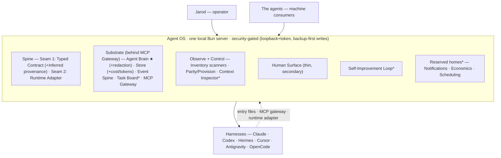

# Agent OS — Whole-System Architecture

> The cohesion map: every major component, how they connect, what's built when, and where slice 1 fits.
> Produced **2026-07-02** (decision #12) by consolidating `STRATEGY.md`, `FEATURE-SLATE.md`, `MEMORY-SYSTEM-VISION.md`, the slice-1 plan, and the a studied template teardown mining (`reference/studied-template-mined-ideas.md`) into one picture. Jarod affirmed the exit condition: *"I see the whole, and slice 1 is the right first cut."*
> **This is the anti-drift reference — measure new work against it.** Living doc; update it as the build teaches us. (The interactive v0.3 map was the working surface it was authored from.)

## One-liner
Agent OS is the connective tissue over Jarod's agent stack: **one local control plane + one shared brain** that every harness plugs into, so the agents act as one co-located team — and no harness ever gets rebuilt (**connect, don't compete**).

## System diagram

`★ = the wedge (Brain) · * = deferred or reserved (scheduled, never cut — decision #9)`

## The four tracks (STRATEGY)
The product areas everything serves: **Agent Brain** (the wedge — shared memory) · **Observe + Control** (see + *act on* the stack) · **Coordination** (shared work surface + orchestration) · **Self-Improvement Loop** (KPIs → prescribe + run).

## The two seams — the extensibility spine
Get these right and new capabilities/harnesses/remote machines are extensions, not rewrites.
- **Seam #1 — Typed Contract.** One `zod` schema; producer + consumer both import it. Sensitivity + `machineId` baked in. **Hook: `Inferred<T>`** — confidence + evidence on every heuristic value (routing, detection, prescriptions) so "fact vs guess" is a compile-time property (decision #13).
- **Seam #2 — Runtime Adapter.** `start/stream/cancel/health/capabilities/commands`; how the OS *drives* agents. Location-agnostic (`runId`, capability-negotiation) → remote-ready. Slice 1 ships only a typed `RuntimeTarget` sliver; the full adapter is deferred.

## Shared-state substrate — behind the MCP Gateway
- **Agent Brain ★** (shared *knowledge* memory). The 4-layer vision: L1 identity/routing (entry files) · L2 curated wiki · L3 vector archive · L4 ingestion/wrap-up. Slice 1 = the seed (curated handoff + automatic raw breadcrumb trail). **Hook: redaction/consent choke-point** at the ingest + retrieval boundaries — raw content never reaches the typed contract or any shareable/synced surface unredacted (decision #13).
- **The Store** (typed persistence + run ledger; SQLite/Drizzle behind a repo interface). Records its own reads/writes → the hit-rate metric. **Hook: per-run tokens/cost/model columns** from commit one → a real spend history later (decision #13).
- **Event Spine** (append-only `events` table + a tiny `emit()` wired into the adapter, brain-writes, and scanners; `events.subscribe` on the gateway). Hook #2 — the substrate that Notifications, recall-telemetry, and cron-alerts ride. Ship the spine in slice 1; features attach later with no re-plumbing.
- **Task Board*** (shared *working* memory — blackboard coordination across harnesses). Deferred (Coordination track).
- **MCP Gateway** (one daemon all runtimes point at). Slice 1 = the brain registers as one MCP server (seed); the full multi-server gateway is deferred.

## Observe + Control — the acting surface
- **Inventory scanners** — enumerate skills/MCP/plugins across all runtimes, crash-safe (each returns its empty shape on any throw). *Slice 1.*
- **Parity / Provision** — make skill/MCP X available in harness Y; reversible, gated, real backend. *Slice 1.*
- **Context Inspector*** — context-tax meter + one-click config trims. Deferred.

## Human Surface (thin, secondary)
One operator view over the substrate: cross-project work-state (freshness + lane), inventory grid, provision triggers. Deliberately thin — agents are the primary consumer. *Slice 1 (thin).*

## Self-Improvement Loop*
Watch the KPIs → prescribe + *run* the highest-leverage actions (Dream), mine skill opportunities from repeated asks, cross-agent evals. Deferred (v1.1-adjacent).

## Reserved homes — room to grow (named, not yet scoped) — decision #13
Coherent concerns with no clean home in the four tracks, reserved so future ideas land somewhere:
- **Notifications / Attention** — the OS → Jarod push channel ("page me when an agent's blocked"), one inbox across every runtime. Rides the Event Spine.
- **Economics — Cost & Quota** — what the agents cost / how much runway is left; usage-headroom pacing. Fed by the Store's cost hook.
- **Automation / Scheduling** — active, monitored cron across tools (next-fire times, overdue/missed alerts). Standalone — a different job than orchestrating a team.

## The harnesses — connected, never rebuilt
**Claude · Codex** (native writes, slice 1) · **Hermes** (read-only v1; writes via its `localhost:9119` API in v1.1) · **Cursor · Antigravity · OpenCode** (future). Three plug-in points: **entry files** (L1 identity/routing) · **MCP Gateway** (tools/context/brain) · **Runtime Adapter** (drive/observe). One agent can span several surfaces (CLI/Desktop/IDE/Telegram). A future harness = a new adapter + entry files, not a new product. *(OpenClaw dropped 2026-07-02 — no longer used.)*

## The stack (decided 2026-07-02)
- **Runtime: Bun** — `bun:sqlite` (synchronous embedded driver, no native-compile), `Bun.serve`, single fast-starting binary, zero-config TS/test. Well-matched to a local long-lived daemon + capture workers; scale-maturity (Node's edge) is irrelevant at n=1 user.
- **Storage:** SQLite + Drizzle behind a repo interface (the libSQL/Turso swap point for later sync).
- **Server:** Hono (runs on Bun *and* Node → portability hedge if we ever leave Bun).
- **Contract:** `zod` (single source of truth); MCP tool schemas via `z.toJSONSchema`.
- **MCP:** `@modelcontextprotocol/sdk` v1.29.x (pinned; SDK usage isolated in one module).
- **FE framework: DEFERRED to U11.** Lean: the lightest thing that works (Hono-rendered pages or a small Vite+React SPA); **React Router 7 / Remix over Next** (too heavy for a thin local view). UI = **Tailwind + Shadcn**, a defined design system, **colorblind-safe** (see the human-surface work).

## Where slice 1 sits
**The Brain seed + the parity-enabling half of Observe+Control.** A shared, typed, MCP-native work-state substrate (curated handoff + automatic raw trail) any agent resumes from, plus 4-runtime inventory and Claude→Codex parity actions — one thin vertical slice to a felt checkpoint (a fresh session picks up where the last left off, unprompted). Plan: `plans/2026-07-01-001-feat-slice-1-substrate-parity-plan.md`. The 4 extensibility hooks (#13) are now build constraints on the slice.

## Room to grow — the promise
The two seams **are** the extensibility mechanism. New capability = a contract section + an adapter method. New harness = a new adapter + entry files. Remote machine = one more adapter over a transport. a studied template is the **reference and inspiration, never a 1:1 port** — its ideas (and ones we haven't thought of yet) plug into this same spine. Everything deferred/reserved **deepens** this spine later; it never replaces it (decision #9). Mined idea backlog + "boxes to avoid": `reference/studied-template-mined-ideas.md`.
