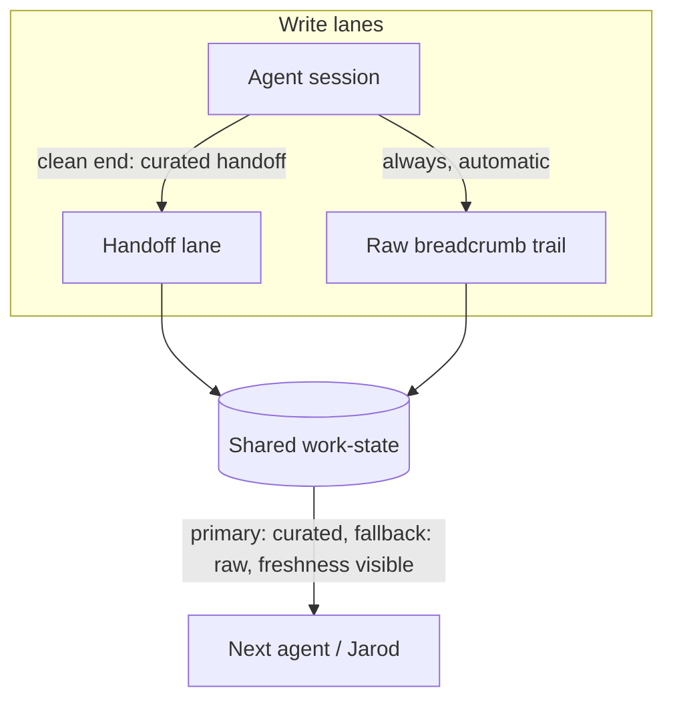
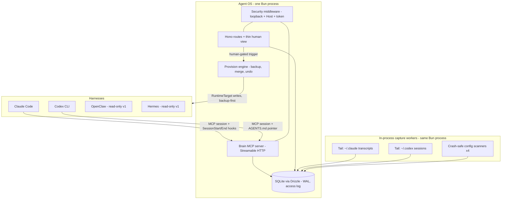

# Slice 1 - Substrate Seed + Parity-Enabling Observe+Control - Plan

## Goal Capsule

- **Objective:** Build slice 1 of Agent OS: a shared, agent-legible work-state substrate (the Brain seed — the v1 flagship) plus the parity-enabling half of Observe+Control, as a thin vertical slice on Claude Code first, then broadened to Codex writes and four-runtime read inventory.
- **Authority hierarchy:** This plan's Product Contract > `STRATEGY.md` (North Star) > `docs/DECISIONS.md` (decisions 1–10 + fork resolutions recorded here) > `docs/FEATURE-SLATE.md` / `docs/MEMORY-SYSTEM-VISION.md` (design grounding) > `docs/reference/studied-template/` (borrow/avoid reference).
- **Stop conditions:** Stop and surface (do not guess) if: a harness surface behaves differently than the Planning Contract records (e.g., transcript JSONL shape, hook payloads); a mutation cannot be made reversible; the MCP SDK v1 API cannot express a needed tool shape; or any work would decide a still-deferred fork (remote adapter, memory routing, full gateway, run-steering).
- **Execution profile:** Thin vertical slice to a felt checkpoint (fresh Claude Code session resumes a real project unprompted) before broadening. Greenfield repo — no legacy constraints, but every seam ships remote-ready per decision #2.
- **Tail ownership:** Implementer owns green tests, the Verification Contract's behavioral scenarios, and removing dead-end experiment code before declaring done.
- **Product Contract preservation:** unchanged from the reviewed requirements version, except Outstanding Questions — the five planning-owned forks are now resolved into Planning Contract KTDs; remaining open items are re-listed as deferred (non-blocking).

---

## Product Contract

### Summary

Slice 1 gives every agent in every harness one shared place to read and write project work-state — so any agent picks up where the last one left off without Jarod re-explaining — and gives Jarod one view of his skills/MCP/plugins across all four runtimes with real actions to propagate them, so spinning up a second harness stops requiring config archaeology.

### Problem Frame

Jarod runs a dozen AI harnesses that share no memory and no work surface. Resuming work today means opening each project in whichever CLI last touched it, hunting for what was in flight, and steering the agent back — and even projects with a START-HERE or handoff doc don't pick up cleanly unless the previous session wrote a solid handoff, which crashed or forgotten sessions never do. The overhead is heavy enough that he avoids multi-agent work entirely and collapses back to Claude Code alone, losing the team. Because of that avoidance, the stack-management pains (fragmented skills, N-times MCP config) have never had the chance to bite; the lived pain is the collapse itself.

### Key Decisions

- **Agents are the primary consumer; Jarod is secondary.** The substrate is built for machine reads/writes first (typed, MCP-native per decision #7); the human surface is a thin secondary view, not a dashboard headline. Accepted consciously: the "first visible slice" has a modest visible part.
- **Scope ranked by "what un-collapses the team," not by lived pain.** The four Observe+Control pains are recorded as assumptions (below), since avoidance kept them hypothetical. The slice contains only what removes the reasons for avoidance.
- **Hybrid freshness for work-state.** Agents write curated handoffs on clean session ends; the OS automatically captures a raw activity breadcrumb trail as fallback. This is the future Brain's two-lane shape at seed scale — curated handoff grows into Wrap-Up→wiki, raw trail grows into full-log→vector (memory vision notes 9–10) — so the full Brain deepens this substrate rather than replacing it.
- **Handoff ≠ Wrap-Up.** The handoff is a continuity cursor ("pick up here"); the Wrap-Up is knowledge extraction (decisions → wiki, raw log → vector archive). Slice 1 ships the handoff lane only, shaped so the Wrap-Up lane attaches later. Planning must reconcile this lane with the existing `/handoff` project skill so exactly one continuity record exists (decision #8 forbids parallel state records); whether the substrate replaces or backs the skill's `START-HERE.md`/`DECISIONS.md` writes is planning's call.
- **Reads cover all four runtimes; the native-write set is planning's call.** Inventory reads Claude Code, Codex, OpenClaw, and Hermes from day one. Which runtimes get native parity writes in v1 is the deferred native-writes fork (decision log, open forks).
- **Everything excluded is deferred with a promotion trigger, never cut** (decision #9).

### Actors

- A1. Jarod — operator; secondary consumer. Reads state at a glance, triggers parity actions.
- A2. Agents (Claude Code, Codex, OpenClaw, Hermes sessions) — primary consumers; read work-state to resume, write curated handoffs.
- A3. Agent OS — captures the raw breadcrumb trail automatically, scans runtime configs, executes parity actions.

### Requirements

**Shared work-state substrate (the Brain seed)**

- R1. An agent in any of the four harnesses can read a project's current work-state — what's in flight, what was last decided, what's next — without Jarod re-explaining it.
- R2. An agent can write a curated handoff (continuity cursor) at a clean session end.
- R3. The OS captures a raw activity breadcrumb trail per session automatically, with no agent or human discipline required, so a crashed or forgotten session still leaves a usable trail.
- R4. Work-state is agent-legible: typed and machine-readable, consumable by agents directly (no human relaying).
- R5. The curated handoff is the primary "pick up here" signal; the raw trail is the fallback when no fresh handoff exists.
- R6. A reader can always tell how fresh the state is and which lane it came from (curated vs raw).

**Stack inventory (observe)**

- R7. One unified view enumerates skills, MCP servers, and plugins across all four runtimes.
- R8. The inventory reflects the actual on-disk configs, not a manually maintained list.
- R9. Scanning is crash-safe: a broken or missing config in one runtime degrades that runtime's entry, never the whole inventory.

**Parity actions (control)**

- R10. From the unified view, Jarod can make a skill or MCP server available in another harness without hand-editing that harness's config format.
- R11. Every mutation is reversible and non-destructive: backup-first, merge-don't-clobber, and gated. No control ships without a real backend.

**Human surface**

- R12. Jarod has a thin view over the substrate and inventory: cross-project work-state and the stack at a glance, freshness visible per R6.

### Key Flows

- F1. Morning pickup
  - **Trigger:** Jarod (or an agent on his behalf) opens a project and asks to resume.
  - **Steps:** Agent reads the project's work-state; resumes from the curated handoff, or from the raw trail when no fresh handoff exists; states which lane it used.
  - **Outcome:** Work continues without Jarod reconstructing or re-explaining.
  - **Covers:** R1, R4, R5, R6.
- F2. Clean session end
  - **Trigger:** A session reaches a natural boundary.
  - **Steps:** The agent writes a curated handoff; the raw trail for the session already exists.
  - **Outcome:** Next pickup is curated-quality.
  - **Covers:** R2, R3.
- F3. Bad session end
  - **Trigger:** Session crashes, machine reboots, or wrap-up is forgotten.
  - **Steps:** No handoff is written; the breadcrumb trail is intact; next pickup uses the raw lane, flagged as uncurated.
  - **Outcome:** Degraded but usable continuity — never a cold start.
  - **Covers:** R3, R5, R6.
- F4. Parity action
  - **Trigger:** Jarod sees a skill or MCP server present in one runtime and absent in another.
  - **Steps:** One action propagates it to the target runtime; the target's prior config is backed up; the change is reversible.
  - **Outcome:** Second harness usable without config archaeology.
  - **Covers:** R7, R10, R11.

### Acceptance Examples

- AE1. **Covers R3, R5, R6.** Given a session that ended without a handoff, when the next agent reads that project's state, then it receives the raw breadcrumb trail explicitly marked as uncurated, with last-activity time visible.
- AE2. **Covers R5, R6.** Given a curated handoff plus newer raw activity after it, when an agent asks "pick up here," then the curated handoff is primary and the newer raw activity is surfaced alongside it.
- AE3. **Covers R10, R11.** Given a skill installed only in Claude Code, when Jarod triggers a parity action targeting a write-enabled runtime, then the skill becomes available there, the prior config is backed up, and the action can be undone.
- AE4. **Covers R9.** Given one runtime with a corrupt config file, when the inventory scans, then the other three runtimes' entries are complete and the broken one is shown as degraded, with the scan otherwise succeeding.
- AE5. **Covers R8.** Given a skill added to one runtime's real config after the last scan, when the inventory refreshes, then the new skill appears — and no inventory entry exists that is absent from every runtime's actual config.

### Success Criteria

- Jarod runs a second harness on a real project — the un-collapse signal this slice exists for.
- Repeat-yourself count trends toward zero (STRATEGY metric: re-explaining ways-of-working or project context to an agent that should know).
- Shared-brain hit rate becomes measurable: the substrate itself records reads and writes, so the fraction of sessions using it is observable regardless of where the MCP gateway lands in slice sequencing.
- Zero observe-only controls ship: every button in the slice has a working backend.

### Scope Boundaries

**Deferred for later — with promotion triggers (decision #9: deferred, never cut)**

- Run-steering / live-agent view — promotes when Jarod is actually running multi-agent work. (The RuntimeAdapter seam and mock vendor-cloud adapter acid test ride with it.)
- Context inspector (context-load visibility and trims) — promotes when there is a live stack worth trimming.
- Full 4-layer Agent Brain (Wrap-Up extraction, OKF wiki curation, vector archive, Wagers) — the v1.1 deepening of this same substrate.
- Full MCP gateway (all runtimes point every MCP server at one local daemon, configured once) — the substrate's MCP server is its seed; promotes when a third shared MCP server needs configuring N times, or at v1.1.
- Agent-triggered self-provisioning (an agent invoking parity actions unattended) — promotes with a per-tool approval/trust posture; v1 builds the tool agent-callable but human-triggered.
- Plugin propagation — parity actions (R10) cover skills and MCP servers; plugins are observed (R7) but not yet propagated. Promotes when the typed plugin/MCP registry (slate row 8 / §7.2) lands.
- Dream prescription engine — deferred; the Brain seed is the v1 flagship (fork resolved 2026-07-01).
- Hermes/OpenClaw native writes — v1.1, via Hermes's `localhost:9119` API (write surface needs discovery) and OpenClaw's own format.
- Remote runtimes / Rung 3, A2A export adapter — per `docs/FEATURE-SLATE.md` §5; seams stay remote-ready.

**Outside this product's identity**

- Replacing or forking any agent harness. Connect, don't compete.

### Dependencies / Assumptions

- **Assumption (the slice's core bet):** the collapse to a single harness is driven mainly by continuity and setup overhead — the friction this slice removes. STRATEGY.md names a third co-equal driver, ADHD terminal-overload, which slice 1 only partially relieves (R12's one-glance view); fuller relief is the deferred run-steering view. If terminal-overload turns out to be the dominant driver, the un-collapse signal can fail with every requirement met.
- **Assumption:** automatic breadcrumb capture is achievable per harness — and the captured trail is *sufficient to resume from*, not merely present (F3's usable-continuity outcome rests on both; validate early). Where a harness resists capture, visible staleness (R6) covers the gap rather than blocking the slice.
- **Assumption:** making work-state readable (R1, R4) does not by itself make agents read it — session-start consumption must be engineered per harness, and the shared-brain hit-rate criterion depends on it.
- **Assumption:** the four Observe+Control pains (fragmented skills, N-times MCP config, context load, run visibility) are anticipated, not lived; validate against real use before deepening any of them.
- **Dependency:** harness surfaces are undocumented contracts — Claude Code transcript JSONL shape, hook payloads, `~/.claude.json` layout, Codex `config.toml` and session logs can change between versions. The capture/scan layer isolates them behind per-harness modules.
- **Ground truth:** the repo contains no source code yet (docs only, verified 2026-07-01); this slice is the first build.

### Open Questions

All items deferred (non-blocking); no launch blockers remain.

- OpenClaw and Hermes work-state lanes (capture + consumption mechanisms) — owned by the U12 spike; no mechanism is committed until verified.
- Memory routing model (agent-driven vs orchestrated retrieval) — deferred to memory architecture, post-NotebookLM (decision log).
- Hermes `localhost:9119` write API surface — discovery needed before v1.1 native writes.

---

## Planning Contract

### Key Technical Decisions

- KTD1. **The substrate ships as a local MCP server — the gateway seed.** One long-lived local process exposes the Brain seed over Streamable HTTP; Claude Code and Codex connect as independent MCP sessions. Pin `@modelcontextprotocol/sdk` **v1.29.x** (v2 is beta with breaking pre-releases until ~2026-07-28); isolate SDK usage in one module so the v2 migration is a swap, not a rewrite. The full multi-server gateway is deferred (Scope Boundaries) — but the brain registers in harness configs exactly like any third-party MCP server, dogfooding the seam.
- KTD2. **One zod schema is the single source of truth (seam #1).** A `Contract` schema package defines WorkState, Handoff, Breadcrumb, InventoryItem, and RuntimeTarget records; producers validate at the write boundary and return `z.infer` types; MCP tool input/output schemas derive via zod v4's native `z.toJSONSchema` (do not adopt the deprecated `zod-to-json-schema`). `machineId`/`source` discriminators and schema-marked sensitivity (`secret | personal | path`) ship in the first version of every record — redaction keys off the type, never a magic field name (teardown Gotcha #7). Sensitivity is *assigned at capture* (U5 classifies: secret-pattern detection, captured user-prompt text defaults to `personal`) and *enforced at the tool-response/API layer* — every MCP tool and content route runs the redaction pass before returning data; view-layer redaction (U11) is defense in depth, not the mechanism.
- KTD3. **Storage: `bun:sqlite` + Drizzle behind a repository interface.** Synchronous driver, `PRAGMA journal_mode=WAL` for concurrent reads under a writing server; migrations via drizzle-kit. The repo interface is the libSQL/Turso swap point for later sync (slate row 5). The store records its own reads/writes (access log) so the shared-brain hit rate is computed from the substrate, independent of gateway sequencing.
- KTD4. **Two-lane capture, tail-based raw lane.** The raw breadcrumb lane tails each harness's own session logs — Claude Code `~/.claude/projects/<hash>/<session>.jsonl`, Codex `~/.codex/sessions/YYYY/MM/DD/*.jsonl` — which exist even after a crash; capture never depends on a clean session end. Hooks add the deterministic pieces on Claude Code only: SessionEnd (side-effect capture on graceful ends) and SessionStart. The curated lane is the `write_handoff` MCP tool, invoked by agents/skills — never an automatic process (curation requires judgment).
- KTD5. **Consumption is engineered per harness, asymmetrically.** Claude Code: a SessionStart hook calls the substrate and injects work-state via `hookSpecificOutput.additionalContext` — deterministic. Codex: `AGENTS.md` pointer + the MCP read tool — compliance-dependent, so its hit rate is measured (KTD3's access log), not assumed. OpenClaw/Hermes: no mechanism committed until the U12 spike verifies their surfaces.
- KTD6. **Write discipline generalized from the teardown's one proven path.** Every config mutation: timestamped backup → merge-don't-clobber → gate → undo restores the named backup. Two distinct modules: the **config-write engine** (U14 — file backup/merge/undo, consumed by installers and provisioning) and the **HTTP security middleware** (U3 — loopback source check + Host-header check + per-boot token, `0600` file; one wrapper, not per-handler calls). The token is required on every content-returning and mutating route (health only exempt), and callers acquire it by **reading the token file at call time** — hooks and skills run as Jarod, so a stale post-reboot token is impossible by convention; installed configs never embed the token. Parity writes dispatch against a typed `RuntimeTarget` descriptor (id, config surfaces, capabilities), never hardcoded `~/.claude` paths — the seam #2 sliver without building the full RuntimeAdapter.
- KTD7. **Parity tools are agent-callable, human-gated in v1.** `provision_skill` / `provision_mcp` are MCP tools shaped for future agent use, but v1 exposes triggers only in the human view; agent self-provisioning is deferred with a trust-posture trigger.
- KTD8. **The `/handoff` skill is rewired through the substrate.** `write_handoff` becomes the one continuity record (decision #8); the skill's `START-HERE.md`/`DECISIONS.md` updates become human-readable projections derived from (and after) the substrate write. If the substrate is unreachable, the skill falls back to docs-only and flags it. Handoff records are keyed by `(project, sessionId)` — concurrent sessions never overwrite each other — with a project-level current cursor resolved deterministically (most recent clean end); the full set stays queryable.
- KTD9. **One server process, dev = prod.** `Bun.serve` + Hono hosts the MCP endpoint, the JSON API, and the thin human view; typed routes (Hono RPC), no dev-middleware-only backend (the template's fatal defect). Capture tailers and inventory scanners run as **in-process workers** inside this same process — one SQLite writer by construction, no multi-process busy handling. The process is supervised (U15: launchd LaunchAgent, KeepAlive) so reboots and crashes never produce silent cold starts. Response caching only where a view polls.

### High-Level Technical Design

Sequencing: **U13 runs first and gates everything** — a throwaway spike that validates the two slice-killing assumptions (trail resume-sufficiency, injection quality) before any architecture is built. Phase A (U1 → U14 → U2 → U3 → U4 → U5 → U6 → U7 → U15) is the vertical slice on Claude Code — contract → write-discipline engine → store → server → MCP tools → capture → consumption → `/handoff` rewire → supervised service — ending at the felt checkpoint. Phase B (U8–U12) broadens: Codex, scanners, parity, human view, read-only-lane spike.

---

## Implementation Units

| U-ID | Title | Key files | Depends on |
|---|---|---|---|
| U13 | Throwaway resume spike (gates Phase A) | none kept | — |
| U1 | Scaffold + typed contract core | `src/contract/schema.ts` | — |
| U14 | Config-write discipline engine | `src/configwrite/engine.ts` | U1 |
| U2 | Store + persistence | `src/store/*` | U1 |
| U3 | Server spine + security middleware | `src/server/*` | U1, U2 |
| U4 | Brain MCP server + work-state tools | `src/mcp/*` | U1–U3 |
| U5 | Claude Code breadcrumb capture | `src/capture/claude-code.ts` | U2 |
| U6 | Claude Code consumption + hooks installer | `hooks/*`, `src/install/claude-code.ts` | U3, U4, U5, U14 |
| U7 | `/handoff` skill rewire | `.claude/skills/handoff/SKILL.md` | U4 |
| U15 | Server supervision (launchd) | `src/install/launchd.ts` | U3, U14 |
| U8 | Codex integration | `src/capture/codex.ts`, `src/install/codex.ts` | U4, U5, U14 |
| U9 | Four-runtime inventory scanners | `src/scan/*` | U1, U2 |
| U10 | Parity actions (provision engine) | `src/provision/*` | U3, U9, U14, U6/U8 |
| U11 | Thin human view | `src/view/*` | U2, U9, U10 |
| U12 | OpenClaw + Hermes lane spike | findings → `docs/DECISIONS.md` | U4 |

### U13. Throwaway resume spike (gates Phase A)

- **Goal:** Falsify or confirm the two slice-killing assumptions — raw-trail resume-sufficiency and injection resume quality — before any architecture is built.
- **Requirements:** the core-bet and readable≠read assumptions; previews VS1/VS2.
- **Dependencies:** none — first work in the slice.
- **Files:** none kept — spike code is discarded; the go/no-go judgment and observations are recorded in `docs/DECISIONS.md`.
- **Approach:** Hardcode a work-state blob into a SessionStart hook (`additionalContext`) on one real project and judge the felt resume; hand-build one raw trail from a real killed session and judge whether a fresh agent can continue from it.
- **Test scenarios:** Test expectation: none — throwaway spike; the deliverable is a recorded go/no-go before U1 starts.
- **Verification:** Go/no-go recorded with observations; Phase A proceeds only on go.

### U1. Project scaffold + typed contract core

- **Goal:** A Bun/TypeScript workspace whose first real module is the zod contract — seam #1 exists before any feature.
- **Requirements:** R4; KTD2.
- **Dependencies:** none.
- **Files:** `package.json`, `tsconfig.json`, `src/contract/schema.ts`, `src/contract/index.ts`, `tests/contract.test.ts`.
- **Approach:** Define `WorkState`, `Handoff`, `Breadcrumb`, `InventoryItem`, `RuntimeTarget` schemas with `machineId`, `source` discriminators, sensitivity markers, freshness/lane fields (R6 fields live in the schema, not the view). Export inferred types and `z.toJSONSchema` outputs for MCP tool registration.
- **Test scenarios:** valid records round-trip parse; producer-shaped drift (count-vs-array on a field) fails at parse; sensitivity-marked fields enumerate for a redaction pass; JSON Schema export contains tool-usable shapes; unknown `source` variant rejects.
- **Verification:** `bun test` green; `tsc --noEmit` clean; a deliberate schema/consumer mismatch fails compilation.

### U2. Store + persistence

- **Goal:** Durable typed storage with a self-recording access log.
- **Requirements:** R3, R6, Success Criteria (hit rate); KTD3.
- **Dependencies:** U1.
- **Files:** `src/store/db.ts`, `src/store/schema.ts` (Drizzle tables), `src/store/repo.ts` (repository interface), `drizzle.config.ts`, `tests/store.test.ts`.
- **Approach:** Tables: `projects`, `handoffs` (keyed by project + sessionId), `breadcrumbs`, `inventory`, `access_log`, `capture_cursor` (source file path → last byte offset). WAL on open. Repository interface returns contract types (validate on read of anything externally sourced). Every substrate read/write appends to `access_log` with `{sessionId?, harness, tool, project, ts}`.
- **Test scenarios:** handoff write→read round-trip; two concurrent handoff writes to one project persist both records and resolve one deterministic current cursor (most recent clean end); breadcrumb append is idempotent per event id (tailer will re-read); freshness/lane derivation (curated newer than raw, raw newer than curated — AE2 logic); access log rows created on read and write; hit-rate query returns fraction of distinct sessions that touched the store; concurrent breadcrumb + handoff + access-log writes from in-process workers never raise `SQLITE_BUSY`; `capture_cursor` round-trips offsets.
- **Verification:** `bun test` green; `drizzle-kit generate && drizzle-kit migrate` produce a working db from scratch.

### U3. Server spine + security middleware

- **Goal:** The one long-lived local process, secured, dev = prod.
- **Requirements:** R11 (gate half); KTD6, KTD9.
- **Dependencies:** U1, U2.
- **Files:** `src/server/index.ts`, `src/server/security.ts`, `src/server/routes.ts`, `tests/security.test.ts`.
- **Approach:** `Bun.serve` + Hono; one middleware enforcing loopback remote address, Host-header allowlist (anti DNS-rebind), and per-boot token (`0600` file, `X-Agent-OS-Token`) on every content-returning and mutating route — health only exempt. (The token-gated `GET /work-state?project=` route was **deferred to U4** — decision #17 — so it ships alongside the MCP `read_work_state` tool and shares one redaction choke-point + response presenter.) Hono RPC type export for the view.
- **Test scenarios:** non-loopback source rejected; bad Host header rejected; missing/wrong token rejected on content and mutation routes while health stays exempt; a token from a prior boot is rejected while a fresh token-file read succeeds; token file mode is `0600`; server starts from a production build (no dev-server dependency) — the anti-`the dev-server config` check.
- **Verification:** `bun test` green; `bun run build && bun run start` serves health + a store-backed route.

### U4. Brain MCP server + work-state tools + the redaction choke-point

- **Goal:** The substrate is agent-consumable: MCP tools over Streamable HTTP, plus the token-gated `GET /work-state` HTTP route (moved here from U3 per decision #17) — both reading through **one** redaction choke-point so they can never disagree.
- **Requirements:** R1, R2, R4, R5, R6; KTD1, KTD2. **Absorbs from U3:** the `GET /work-state` route (#17). **Absorbs from U2:** U2-R1 (repo-boundary write validation) + the U2-R5 / U2-R6 promotion triggers (see Scope reconciliation).
- **Dependencies:** U1–U3.
- **Files:** `src/redact/apply.ts` (the shared redaction applier — **NEW; no applier exists yet**), `src/workstate/response.ts` (the one shared read→redact→present→log path — exact home implementer's call, but it MUST be a single path), `src/mcp/server.ts`, `src/mcp/tools.ts`, `src/server/routes.ts` (add the `/work-state` route), `tests/redact.test.ts`, `tests/mcp.test.ts`.
- **Approach:**
  - **Redaction applier (`src/redact/apply.ts`) — the one net-new design; build it FIRST, test-first.** `enumerateSensitive(schema)` (sensitive field paths + levels) and `maxSensitivity` already exist as the *inputs*; the applier that consumes them does not. Given a value + its schema, walk the enumerated sensitive paths and mask each leaf. For a `Breadcrumb`, escalate per-record: `maxSensitivity(field's static schema mark, record.sensitivity)` — a `personal`-marked `summary` on a `secret`-classified breadcrumb must redact as `secret` (`Cursor.inFlight` is already `secret`). This is the decision #12–13 redaction choke-point; every content-returning path funnels through it.
  - **One shared work-state read path (`src/workstate/response.ts`):** `repo.readWorkState → redact(value, WorkState) → present` (the snake_case `{handoff, raw_trail_tail, freshness, lane, last_activity}` shape with `freshness` computed) `→ log access_log`. BOTH the MCP `read_work_state` tool and the `GET /work-state` route call this one function, so their payloads are byte-identical **by construction** (VS parity), not by two implementations kept in sync.
  - **MCP server:** `@modelcontextprotocol/sdk@1.29.x` pinned (**verify the transport API against live docs, not memory** — the `StreamableHTTPServerTransport` / `mcp-session-id` surface is version-sensitive). One `McpServer`, transport-per-session keyed on `mcp-session-id`. Tools: `read_work_state(project)`; `write_handoff(project, cursor)`; `query_breadcrumbs(project, since)`. Tool schemas from U1's `jsonSchemas` export.
  - **U2-R1 (repo-boundary validation) — KEEP, land it here:** `write_handoff` receives external MCP/HTTP JSON — validate it through the contract zod schema (`Cursor`/`Handoff`) at the write boundary **before** `repo.writeHandoff`. Never trust TS types for untrusted input.
  - All tool + route calls log to `access_log`.
- **Scope reconciliation (why §U4 grew — keep drift visible):** decision #17 deferred `/work-state` + redaction out of U3 (so U3 shipped as a pure security-spine unit), which lands the redaction applier + shared response path here as net-new work. Two U2 residuals name U4 as their promotion trigger and are folded in: **U2-R6** — cap the unbounded `rawTrailTail` in the response (a most-recent-N limit sized to real resume needs, not a guessed N); **U2-R5** — decide `hitRate` project scoping now that per-tool consumption is real.
- **Execution note:** Start the applier test-first against the secret-marked fixture; then a failing integration test that drives the tools through a real MCP client session (the SDK's client transport), not direct function calls.
- **Test scenarios:** two concurrent client sessions get distinct session ids and isolated streams; `read_work_state` on a project with handoff+newer-raw returns curated as primary with raw surfaced (AE2); on a project with raw only, returns lane `raw`, marked uncurated, with last-activity (AE1); `write_handoff` persists and flips freshness; two concurrent `write_handoff` calls on one project persist both and resolve one deterministic current cursor; **`write_handoff` with a schema-invalid cursor rejects at the repo boundary and does NOT persist (U2-R1);** tool responses run the redaction applier — a fixture breadcrumb whose `summary` is `secret`-classified returns redacted, and a `Cursor.inFlight` returns redacted; **the `GET /work-state` route returns byte-identical payload to the `read_work_state` tool for the same fixture (shared-path parity);** **a project with a long raw trail returns a capped `raw_trail_tail` (U2-R6), not an unbounded dump;** malformed tool input rejects via schema and does not crash the server.
- **Verification:** integration test green over real Streamable HTTP on localhost; redaction-applier unit tests green.

### U5. Claude Code breadcrumb capture (raw lane)

- **Goal:** Crash-safe raw trail for the primary harness, validated as resume-sufficient.
- **Requirements:** R3; KTD4; core-bet assumption (trail sufficiency).
- **Dependencies:** U2.
- **Files:** `src/capture/claude-code.ts`, `src/capture/tailer.ts`, `tests/capture-claude.test.ts`.
- **Approach:** Watch `~/.claude/projects/**/*.jsonl`; map project-hash dirs to project paths; extract a breadcrumb per meaningful event (user prompt, tool call summary, file edits), classifying sensitivity at capture (KTD2: secret-pattern detection, user-prompt text defaults to `personal`), with byte-offset resume state persisted in `capture_cursor` so restarts don't duplicate. Isolate all JSONL-shape knowledge in this module (undocumented contract).
- **Execution note:** Before building extraction breadth, run the sufficiency check: kill a real session mid-task, generate the trail, and judge whether a fresh agent can resume from it — this validates the review-flagged assumption early.
- **Test scenarios:** tailer resumes from `capture_cursor` offset after process restart without duplicates; malformed JSONL line skipped without killing the tail; session→project mapping correct for a project path with symbols; crash simulation (no SessionEnd) still yields a trail ending at last activity; breadcrumbs from a fixture transcript are human-readable summaries, not raw dumps; a fixture transcript containing a pasted API key persists it secret-marked and it returns redacted through `read_work_state`.
- **Verification:** fixture-driven tests green; manual crash test on a real session produces a trail an agent can act on (recorded in PR notes).

### U6. Claude Code consumption + clean-end hooks

- **Goal:** Fresh Claude Code sessions *consume* the substrate deterministically; graceful ends are captured.
- **Requirements:** R1, R5, R6; KTD5; readable≠read assumption.
- **Dependencies:** U3, U4, U5, U14.
- **Files:** `hooks/session-start.ts`, `hooks/session-end.ts`, `src/install/claude-code.ts`, `tests/hooks.test.ts`.
- **Approach:** SessionStart hook (matcher `startup|resume|clear`) calls the token-gated `GET /work-state` route (reading the token file at call time) and emits `hookSpecificOutput.additionalContext` with the work-state summary + lane/freshness. SessionEnd hook records a graceful-end marker breadcrumb (it must NOT be load-bearing for capture — U5 owns that). Installer registers hooks in `~/.claude/settings.json` AND the brain MCP server in `~/.claude.json` — two different files by design (research-documented split) — both via the U14 config-write engine (backup-first, merge).
- **Test scenarios:** hook script, given a SessionStart payload fixture, emits valid `additionalContext` JSON; substrate-unreachable → hook exits cleanly with no context (never blocks session start); installer merge preserves Jarod's existing hooks (his settings.json is heavily populated — merge, don't clobber, is load-bearing here); installer writes MCP registration to `~/.claude.json` and hooks to `settings.json` without cross-contaminating; uninstall restores from backup.
- **Verification:** VS1 behavioral check (Verification Contract) passes on a real project.

### U7. `/handoff` skill rewire (one continuity record)

- **Goal:** The existing skill writes through the substrate; docs become projections (decision #8, KTD8).
- **Requirements:** R2, R5.
- **Dependencies:** U4.
- **Files:** `.claude/skills/handoff/SKILL.md`.
- **Approach:** Skill instructs: call `write_handoff` first (via the brain MCP tools available in-session); then update `START-HERE.md`/`DECISIONS.md` as human projections; on substrate unreachable, docs-only fallback with an explicit staleness flag in the doc.
- **Test scenarios:** Test expectation: behavioral, not unit — run the skill on this repo; verify one substrate record + consistent doc projection (VS3), and the fallback path when the server is stopped.
- **Verification:** VS3 passes; no second machine-readable continuity record exists anywhere.

### U8. Codex integration (writes + raw lane + consumption pointer)

- **Goal:** The second harness joins: substrate access, breadcrumbs, and measured consumption.
- **Requirements:** R1–R6 for Codex; KTD4, KTD5; write-set fork (Claude Code + Codex).
- **Dependencies:** U4, U5 (tailer core), U14 (config-write engine).
- **Files:** `src/capture/codex.ts`, `src/install/codex.ts`, `templates/agents-md-pointer.md`, `tests/capture-codex.test.ts`.
- **Approach:** Register the brain MCP server in `~/.codex/config.toml` (`[mcp_servers.agent-os]` with `url`) via the shared write discipline; tail `~/.codex/sessions/**/rollout-*.jsonl` for breadcrumbs; ship an `AGENTS.md` pointer block instructing session-start `read_work_state`. Investigate Codex hooks (`features.hooks`) during implementation — if payloads support it, add injection; do not plan-commit to it (research flagged unverified).
- **Test scenarios:** config.toml merge adds the server without disturbing existing tables and is undoable; Codex session fixture yields breadcrumbs; access-log distinguishes Codex sessions so its hit rate is computable separately from Claude Code's.
- **Verification:** a real Codex session lists and calls `read_work_state`; VS6 shows per-harness hit rate.

### U9. Four-runtime inventory scanners

- **Goal:** The observe half: one typed inventory across all four harnesses, crash-safe.
- **Requirements:** R7, R8, R9; AE4, AE5.
- **Dependencies:** U1, U2.
- **Files:** `src/scan/claude-code.ts`, `src/scan/codex.ts`, `src/scan/openclaw.ts`, `src/scan/hermes.ts`, `src/scan/index.ts`, `tests/scan.test.ts`.
- **Approach:** One scanner per source, each returning its empty shape on any throw (teardown KEEP#3); composed sequentially. Surfaces: Claude Code — `~/.claude.json` (global + per-project `mcpServers`), project `.mcp.json`, `~/.claude/skills/` + project `.claude/skills/`, `~/.claude/plugins/`, `settings.json` (enabled plugins); Codex — `~/.codex/config.toml`; OpenClaw — `~/.openclaw/openclaw.json`; Hermes — `~/.hermes/` (config.yaml, skills/). Emit contract `InventoryItem`s with `source` discriminators; never emit fields nothing reads (teardown Gotcha #10).
- **Test scenarios:** corrupt fixture for one runtime degrades only that runtime (AE4); skill added to a fixture config appears on rescan and no phantom entries exist (AE5); MCP servers found in `~/.claude.json` not `settings.json` (the documented trap); symlinked skills followed; missing home-dir file → empty shape, no throw.
- **Verification:** `bun test` green against fixtures of all four config layouts; live scan on Jarod's machine enumerates plausibly (spot-checked).

### U10. Parity actions (provision engine)

- **Goal:** The control half: make skill/MCP X available in harness Y, reversibly.
- **Requirements:** R10, R11; AE3; KTD6, KTD7.
- **Dependencies:** U3 (gate), U9 (inventory), U14 (config-write engine), U6/U8 (per-harness target knowledge).
- **Files:** `src/provision/engine.ts`, `src/provision/targets.ts` (RuntimeTarget descriptors for Claude Code + Codex), `src/mcp/provision-tools.ts`, `tests/provision.test.ts`.
- **Approach:** `provision_skill` (copy/symlink into target's skills dir) and `provision_mcp` (merge server entry into target config) dispatch against `RuntimeTarget` descriptors. Every write: timestamped backup → merge → undo journal entry. Exposed as MCP tools (agent-callable shape) but v1 triggers only from the human view (KTD7).
- **Test scenarios:** AE3 end-to-end against fixture homes (skill CC→Codex; MCP server Codex→CC); undo restores byte-identical prior config; provisioning an already-present item is a no-op, not a duplicate; write to a read-only target (OpenClaw) rejects with a clear "deferred to v1.1" error, never a silent no-op; all mutations pass the U3 gate.
- **Verification:** `bun test` green; one real provision + undo on Jarod's machine recorded in PR notes.

### U11. Thin human view

- **Goal:** R12: the one-glance surface — projects with freshness/lane, inventory grid, provision trigger.
- **Requirements:** R6, R7, R12; F4 trigger.
- **Dependencies:** U2, U9, U10.
- **Files:** `src/view/index.tsx` (or server-rendered `src/view/page.ts` — implementer's call), `tests/view.test.ts`.
- **Approach:** Served by the U3 server; reads the same repository the MCP tools read (VS5 parity). One page: project work-state list (freshness + lane badges), inventory matrix (item × runtime presence), provision button per gap wired to U10. No cinematic shell — the teardown's CUT list governs.
- **Test scenarios:** view renders from a store fixture with zero network mocks of its own API (same source as tools); freshness/lane shown for each project matches `read_work_state` output for the same fixture (VS5); provision button absent/disabled for read-only runtimes; sensitive-marked fields are redacted in rendered output (KTD2's redaction pass).
- **Verification:** manual: Jarod's real morning glance answers "where did we leave off, everywhere" in one screen.

### U12. OpenClaw + Hermes lane spike (verify-before-build)

- **Goal:** Resolve the open question: what capture/consumption is possible for the two read-only harnesses.
- **Requirements:** Open Questions (OpenClaw/Hermes lanes); feeds v1.1 promotion triggers.
- **Dependencies:** U4 (something to consume).
- **Files:** `docs/plans/` follow-up notes or `docs/DECISIONS.md` row (findings land as decisions, not code).
- **Approach:** Timeboxed spike: enumerate Hermes 9119 endpoints (read AND write surface), OpenClaw session/log artifacts, and any injection point either exposes. Output = a recorded decision on each harness's v1.1 lane (or explicit "no viable lane; staleness flagging covers it" per the contract's assumption).
- **Test scenarios:** Test expectation: none — spike; the deliverable is a written decision with evidence.
- **Verification:** DECISIONS.md row added; v1.1 promotion triggers updated with the verified mechanism names.

### U14. Config-write discipline engine

- **Goal:** The one shared file-mutation utility every installer and provision action uses: timestamped backup → merge-don't-clobber → undo journal.
- **Requirements:** R11; KTD6.
- **Dependencies:** U1.
- **Files:** `src/configwrite/engine.ts`, `src/configwrite/undo.ts`, `tests/configwrite.test.ts`.
- **Approach:** Format-aware merge (JSON, TOML, YAML) behind one API; write-to-temp + atomic rename; every mutation records an undo-journal entry naming its backup; backups carry `0600` permissions and live under the OS's own data dir (configs embed credentials — backups must not be more exposed than originals).
- **Test scenarios:** merge preserves unrelated keys across JSON/TOML/YAML fixtures; backup created (mode `0600`) before any write; undo restores the named backup byte-identically; a failure mid-write leaves the original file intact; double-provision is idempotent at the engine level.
- **Verification:** `bun test` green; U6's installer is the first real consumer.

### U15. Server supervision (launchd)

- **Goal:** The server survives reboots and crashes — a down substrate can never silently produce cold starts.
- **Requirements:** KTD9; the Definition of Done's lived felt checkpoint; VS7.
- **Dependencies:** U3, U14.
- **Files:** `src/install/launchd.ts`, `templates/com.agent-os.server.plist`, `tests/launchd.test.ts`.
- **Approach:** macOS LaunchAgent with `RunAtLoad` + `KeepAlive`, installed to `~/Library/LaunchAgents` via the U14 engine; supervision status surfaced on the health endpoint.
- **Test scenarios:** rendered plist passes `plutil -lint`; install is idempotent; uninstall stops the service and removes the plist via backup-restore.
- **Verification:** VS7 — after a simulated crash (`launchctl kickstart -k`) and after logout/login, the health endpoint is reachable before any session starts.

---

## Verification Contract

Commands (from repo root, once U1 lands): `bun test` (all units), `tsc --noEmit` (types), `bun run build && bun run start` (prod-mode smoke — the anti-dev-middleware gate).

Behavioral scenarios (the slice's real done signals — run on Jarod's machine, results recorded in the PR):

| # | Scenario | Proves |
|---|---|---|
| VS1 | Fresh Claude Code session on a project with existing work-state has the handoff in context without Jarod pasting anything (hook fired, tool ran) | Consumption, not just readability — R1/KTD5 |
| VS2 | Session killed mid-task (no handoff); fresh session resumes from the raw trail, marked uncurated, last-activity visible, and the resumption is judged sufficient to continue | AE1, F3, trail-sufficiency assumption |
| VS3 | After `/handoff` runs, exactly one machine-readable continuity record exists; docs agree with it | Decision #8, KTD8 |
| VS4 | Provision a skill into Codex, use it there, undo restores the prior config byte-identically | AE3, R10/R11 |
| VS5 | `read_work_state` and the human view show identical freshness/lane for the same project | R6 context parity |
| VS6 | Hit-rate query returns per-harness fractions from the access log, gateway-independent | Success criterion instrumentation |
| VS7 | After a simulated crash (`launchctl kickstart -k`) and after logout/login, the server is reachable before any session starts | KTD9/U15 — no silent cold starts |

Quality gates: no route without a working backend (grep the view for handlers that only toast/log — the teardown's dead-control check); every mutating endpoint behind the U3 middleware; contract package is the only source of shared types (no `as any` at the producer/consumer seam).

---

## Definition of Done

Global:
- All seven VS scenarios pass on Jarod's machine and are recorded in the PR description.
- U13's go/no-go was recorded before Phase A architecture was built.
- `bun test`, `tsc --noEmit`, and the prod-mode smoke all green in CI (or locally until CI exists).
- The felt checkpoint is real: Jarod opens a fresh session on an active project and it picks up where he left off, unprompted (VS1+VS2 lived, not just tested).
- Codex is provisioned and has made at least one real substrate read (the un-collapse signal has its first data point).
- U12's findings are recorded in `docs/DECISIONS.md`.
- No abandoned-attempt code remains in the diff; fixtures and spike scratch are pruned.

Per-unit: each unit's Verification line, plus its test scenarios implemented (or its recorded `Test expectation: none` reason).

---

## Risks & Dependencies

- **MCP SDK v1→v2 transition (medium):** v2 stabilizes ~2026-07-28 with a package split. Mitigation: pin v1.29.x, isolate SDK touchpoints in `src/mcp/`, note the migration as a v1.1 chore.
- **Undocumented harness surfaces (high likelihood, low blast radius):** transcript JSONL shape, hook payload fields, and config layouts can shift with harness updates. Mitigation: per-harness modules own all format knowledge; fixtures pin observed shapes; scanners degrade per R9 instead of failing.
- **Codex consumption compliance (medium):** the AGENTS.md-pointer path depends on the model choosing to call the tool. Mitigation: hit rate is measured per harness (VS6); if Codex's rate is poor, investigate its `features.hooks` surface (flagged unverified in research) as the v1.1 fix.
- **Trail resume-sufficiency (the slice's sharpest assumption):** mitigated by U5's early manual sufficiency check before extraction breadth is built.
- **Jarod's live configs are the write targets:** installer/provision bugs could damage his daily setup. Mitigation: fixture-home testing first, backup-first discipline everywhere, undo verified byte-identical (VS4) before any real-target run.

---

## Sources / Research

- `docs/FEATURE-SLATE.md` — §2 seams, §3 P0 rows, §7 gateway/board; effort verdicts.
- `docs/reference/studied-template/the rebuild notes.md` — write-path discipline (the save path), typed-contract lessons (Gotchas #5–#7, #10), crash-safe scanner composition, dev-middleware failure.
- `docs/MEMORY-SYSTEM-VISION.md` notes 5, 9, 10 — brain-as-MCP-server; slice-1 lanes as Wrap-Up/L3 seeds.
- Research (2026-07): MCP TS SDK v1.29 Streamable HTTP session pattern (v2 beta warning); Claude Code hooks — SessionStart `additionalContext` injection, SessionEnd reasons, transcript paths, MCP registration split across `~/.claude.json` vs `settings.json`; Codex `config.toml` `[mcp_servers]`, session rollout JSONL, `features.hooks` (unverified detail); zod v4 native `z.toJSONSchema`; Drizzle + `bun:sqlite` sync driver + WAL.
