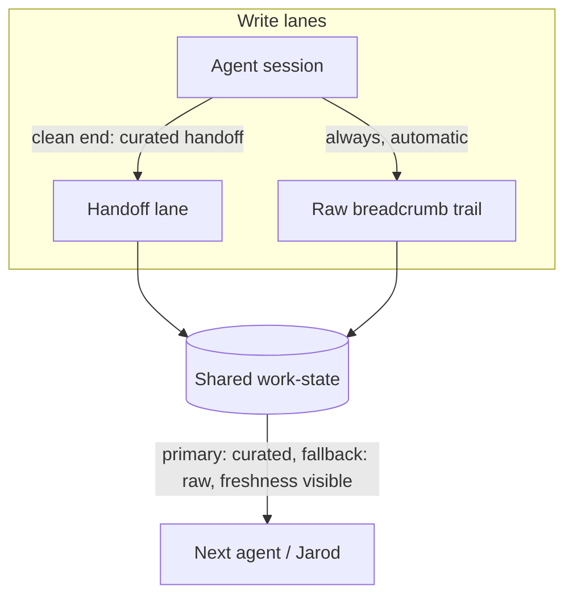

# Slice 1 - Substrate Seed + Parity-Enabling Observe+Control - Plan

## Goal Capsule

- **Objective:** Define slice 1 of Agent OS: a shared, agent-legible work-state substrate (the Brain seed) plus the parity-enabling half of Observe+Control (unified stack inventory + cross-runtime parity actions). The slice exists to un-collapse the team — remove Jarod's reasons for avoiding multi-agent work.
- **Product authority:** `STRATEGY.md` (canonical North Star); `docs/DECISIONS.md` (decisions 1–10 locked); `docs/FEATURE-SLATE.md` (the two seams §2, gateway/board §7); `docs/MEMORY-SYSTEM-VISION.md` (notes 1, 9, 10).
- **Open blockers:** None for planning. Six forks are deliberately deferred to `ce-plan` or later phases — enumerated in `docs/DECISIONS.md` ("Open — deliberately deferred"); Outstanding Questions below lists the planning-owned questions derived from them. Planning must not treat either set as open product scope.

---

## Product Contract

### Summary

Slice 1 gives every agent in every harness one shared place to read and write project work-state — so any agent picks up where the last one left off without Jarod re-explaining — and gives Jarod one view of his skills/MCP/plugins across all four runtimes with real actions to propagate them, so spinning up a second harness stops requiring config archaeology.

### Problem Frame

Jarod runs a dozen AI harnesses that share no memory and no work surface. Resuming work today means opening each project in whichever CLI last touched it, hunting for what was in flight, and steering the agent back — and even projects with a START-HERE or handoff doc don't pick up cleanly unless the previous session wrote a solid handoff, which crashed or forgotten sessions never do. The overhead is heavy enough that he avoids multi-agent work entirely and collapses back to Claude Code alone, losing the team. Because of that avoidance, the stack-management pains (fragmented skills, N-times MCP config) have never had the chance to bite; the lived pain is the collapse itself.

### Key Decisions

- **Agents are the primary consumer; Jarod is secondary.** The substrate is built for machine reads/writes first (typed, MCP-native per decision #7); the human surface is a thin secondary view, not a dashboard headline. Accepted consciously: the "first visible slice" has a modest visible part.
- **Scope ranked by "what un-collapses the team," not by lived pain.** The four Observe+Control pains are recorded as assumptions (below), since avoidance kept them hypothetical. The slice contains only what removes the reasons for avoidance.
- **Hybrid freshness for work-state.** Agents write curated handoffs on clean session ends; the OS automatically captures a raw activity breadcrumb trail as fallback. This is the future Brain's two-lane shape at seed scale — curated handoff grows into Wrap-Up→wiki, raw trail grows into full-log→vector (memory vision notes 9–10) — so the full Brain deepens this substrate rather than replacing it.
- **Handoff ≠ Wrap-Up.** The handoff is a continuity cursor ("pick up here"); the Wrap-Up is knowledge extraction (decisions → wiki, raw log → vector archive). Slice 1 ships the handoff lane only, shaped so the Wrap-Up lane attaches later. Planning must reconcile this lane with the existing `/handoff` project skill so exactly one continuity record exists (decision #8 forbids parallel state records); whether the substrate replaces or backs the skill's `START-HERE.md`/`DECISIONS.md` writes is planning's call.
- **Reads cover all four runtimes; the native-write set is planning's call.** Inventory reads Claude Code, Codex, OpenClaw, and Hermes from day one. Which runtimes get native parity writes in v1 is the deferred native-writes fork (decision log, open forks).
- **Everything excluded is deferred with a promotion trigger, never cut** (decision #9).

### Actors

- A1. Jarod — operator; secondary consumer. Reads state at a glance, triggers parity actions.
- A2. Agents (Claude Code, Codex, OpenClaw, Hermes sessions) — primary consumers; read work-state to resume, write curated handoffs.
- A3. Agent OS — captures the raw breadcrumb trail automatically, scans runtime configs, executes parity actions.

### Requirements

**Shared work-state substrate (the Brain seed)**

- R1. An agent in any of the four harnesses can read a project's current work-state — what's in flight, what was last decided, what's next — without Jarod re-explaining it.
- R2. An agent can write a curated handoff (continuity cursor) at a clean session end.
- R3. The OS captures a raw activity breadcrumb trail per session automatically, with no agent or human discipline required, so a crashed or forgotten session still leaves a usable trail.
- R4. Work-state is agent-legible: typed and machine-readable, consumable by agents directly (no human relaying).
- R5. The curated handoff is the primary "pick up here" signal; the raw trail is the fallback when no fresh handoff exists.
- R6. A reader can always tell how fresh the state is and which lane it came from (curated vs raw).

**Stack inventory (observe)**

- R7. One unified view enumerates skills, MCP servers, and plugins across all four runtimes.
- R8. The inventory reflects the actual on-disk configs, not a manually maintained list.
- R9. Scanning is crash-safe: a broken or missing config in one runtime degrades that runtime's entry, never the whole inventory.

**Parity actions (control)**

- R10. From the unified view, Jarod can make a skill or MCP server available in another harness without hand-editing that harness's config format.
- R11. Every mutation is reversible and non-destructive: backup-first, merge-don't-clobber, and gated. No control ships without a real backend.

**Human surface**

- R12. Jarod has a thin view over the substrate and inventory: cross-project work-state and the stack at a glance, freshness visible per R6.

### Key Flows

- F1. Morning pickup
  - **Trigger:** Jarod (or an agent on his behalf) opens a project and asks to resume.
  - **Steps:** Agent reads the project's work-state; resumes from the curated handoff, or from the raw trail when no fresh handoff exists; states which lane it used.
  - **Outcome:** Work continues without Jarod reconstructing or re-explaining.
  - **Covers:** R1, R4, R5, R6.
- F2. Clean session end
  - **Trigger:** A session reaches a natural boundary.
  - **Steps:** The agent writes a curated handoff; the raw trail for the session already exists.
  - **Outcome:** Next pickup is curated-quality.
  - **Covers:** R2, R3.
- F3. Bad session end
  - **Trigger:** Session crashes, machine reboots, or wrap-up is forgotten.
  - **Steps:** No handoff is written; the breadcrumb trail is intact; next pickup uses the raw lane, flagged as uncurated.
  - **Outcome:** Degraded but usable continuity — never a cold start.
  - **Covers:** R3, R5, R6.
- F4. Parity action
  - **Trigger:** Jarod sees a skill or MCP server present in one runtime and absent in another.
  - **Steps:** One action propagates it to the target runtime; the target's prior config is backed up; the change is reversible.
  - **Outcome:** Second harness usable without config archaeology.
  - **Covers:** R7, R10, R11.

### Acceptance Examples

- AE1. **Covers R3, R5, R6.** Given a session that ended without a handoff, when the next agent reads that project's state, then it receives the raw breadcrumb trail explicitly marked as uncurated, with last-activity time visible.
- AE2. **Covers R5, R6.** Given a curated handoff plus newer raw activity after it, when an agent asks "pick up here," then the curated handoff is primary and the newer raw activity is surfaced alongside it.
- AE3. **Covers R10, R11.** Given a skill installed only in Claude Code, when Jarod triggers a parity action targeting a write-enabled runtime, then the skill becomes available there, the prior config is backed up, and the action can be undone.
- AE4. **Covers R9.** Given one runtime with a corrupt config file, when the inventory scans, then the other three runtimes' entries are complete and the broken one is shown as degraded, with the scan otherwise succeeding.
- AE5. **Covers R8.** Given a skill added to one runtime's real config after the last scan, when the inventory refreshes, then the new skill appears — and no inventory entry exists that is absent from every runtime's actual config.

### Success Criteria

- Jarod runs a second harness on a real project — the un-collapse signal this slice exists for.
- Repeat-yourself count trends toward zero (STRATEGY metric: re-explaining ways-of-working or project context to an agent that should know).
- Shared-brain hit rate becomes measurable: the substrate itself records reads and writes, so the fraction of sessions using it is observable regardless of where the MCP gateway lands in slice sequencing.
- Zero observe-only controls ship: every button in the slice has a working backend.

### Scope Boundaries

**Deferred for later — with promotion triggers (decision #9: deferred, never cut)**

- Run-steering / live-agent view — promotes when Jarod is actually running multi-agent work.
- Context inspector (context-load visibility and trims) — promotes when there is a live stack worth trimming.
- Full 4-layer Agent Brain (Wrap-Up extraction, OKF wiki curation, vector archive, Wagers) — the v1.1 deepening of this same substrate.
- Plugin propagation — parity actions (R10) cover skills and MCP servers; plugins are observed (R7) but not yet propagated. Promotes when the typed plugin/MCP registry (slate row 8 / §7.2) lands.
- Dream prescription engine — flagship fork, decided in `ce-plan`.
- Remote runtimes / Rung 3, A2A export adapter — per `docs/FEATURE-SLATE.md` §5; seams stay remote-ready.

**Outside this product's identity**

- Replacing or forking any agent harness. Connect, don't compete.

### Dependencies / Assumptions

- **Assumption (explicit, unvalidated):** the four Observe+Control pains — fragmented skills, N-times MCP config, context load, run visibility — are anticipated, not lived; avoidance suppressed the behavior that would generate them. Validate against real use before deepening any of them.
- **Assumption (the slice's core bet):** the collapse to a single harness is driven mainly by continuity and setup overhead — the friction this slice removes. STRATEGY.md names a third co-equal driver, ADHD terminal-overload, which slice 1 only partially relieves (R12's one-glance view); fuller relief is the deferred run-steering view. If terminal-overload turns out to be the dominant driver, the un-collapse signal can fail with every requirement met.
- **Assumption:** automatic breadcrumb capture is achievable per harness — and the captured trail is *sufficient to resume from*, not merely present (F3's usable-continuity outcome rests on both; validate early). Where a harness resists capture, visible staleness (R6) covers the gap rather than blocking the slice.
- **Assumption:** making work-state readable (R1, R4) does not by itself make agents read it — session-start consumption must be engineered per harness, and the shared-brain hit-rate criterion depends on it.
- **Dependency:** reading four runtimes' config layouts is custom work — nothing off-the-shelf enumerates Claude Code, Codex, OpenClaw, and Hermes configs.
- **Ground truth:** the repo contains no source code yet (docs only, verified 2026-07-01); this slice is the first build.

### Outstanding Questions

**Deferred to planning (`ce-plan` owns these; do not reopen as product scope)**

- Build order within the slice: substrate-first vs a thin vertical slice threaded through the spine.
- Which runtimes get native parity writes in v1 (current lean: Claude Code + Codex; Hermes/OpenClaw read-only).
- Breadcrumb capture mechanism per harness, and the storage/shape of the work-state substrate.
- Session-start consumption mechanism per harness (startup pointer vs injection) — how a fresh session is induced to read the substrate.
- Where the MCP gateway lands in slice sequencing (slate lean: immediately after the runtime adapter).
- Flagship framing for v1 (bare control plane vs Dream as first tenant).

### Sources / Research

- `STRATEGY.md` — North Star, tracks, metrics; the collapse problem this slice attacks.
- `docs/DECISIONS.md` — decisions 1–10; the open-forks table planning must respect.
- `docs/FEATURE-SLATE.md` — §2 the two seams (typed contract, runtime adapter); §7 MCP gateway + task board; §5 parked items with seam hooks.
- `docs/MEMORY-SYSTEM-VISION.md` — the 4-layer Brain; notes 9–10 map slice 1's hybrid lanes onto Wrap-Up→L2 and raw-log→L3.
- `docs/reference/studied-template/` — the study template's distilled failure modes (observe-only controls, untyped contract drift) that R8–R11 exist to avoid.
