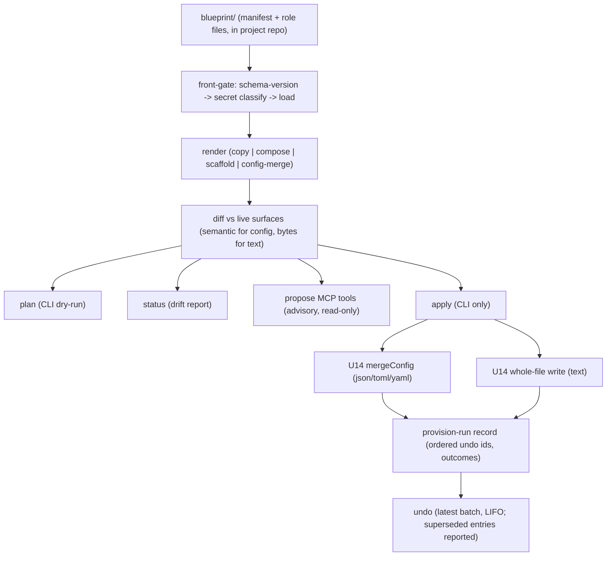
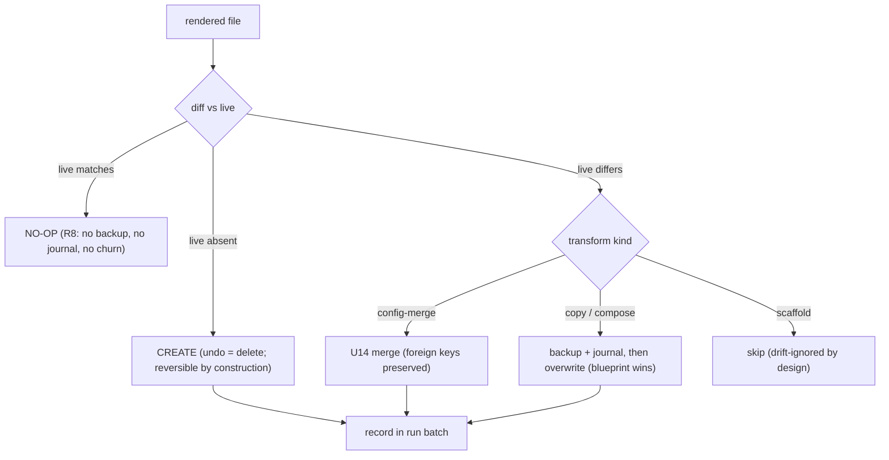

# U10 Provisioning Engine - Plan

## Goal Capsule

- **Objective:** Ship the Act half of slice 1 — a project-scoped provisioning engine that pushes a versioned project blueprint (role bundles) into the native surfaces of Claude Code, Codex, and Cursor, reversibly, via render → diff → apply.
- **Product authority:** This Product Contract, grounded in the lived run-1 spec (the `agent-cost-tracker` repo's `PROVISIONING.md`, per decision #48) and `docs/STAGE-MANAGER-VISION.md`. North star: `STRATEGY.md` (Observe + Control track).
- **Execution profile:** Units run through the standard unit-loop (build → simplify → multi-persona review → Codex adversarial gate → PR → CI green). Every adversarial gate run carries the decision-#45 threat-model pointer in its focus text.
- **Stop conditions:** A finding that would change the Product Contract's scope (not just implementation shape) stops work and returns to Jarod. Cursor surface verification failing (formats don't match the lived run-1 evidence) stops U4 and surfaces before any Cursor write code lands.
- **Open blockers:** None. Three decision-ledger amendments ride along and need rows when this lands: Cursor joins the harness roster (amends #45); the trigger surface supersedes KTD7 — the original slice-1 plan's ruling that provisioning triggers only from the human view (that view, U11, is deferred, so a CLI plus propose-only MCP tools replace it); and the run-file naming ruling — the cross-harness run file is `RUN_STATE.md`, retiring the dogfood's `HANDOFF.md` name so "handoff" means only session-to-session continuity.

---

## Product Contract

### Summary

A project carries a versioned blueprint — role bundles mapping each role to a harness, an optional model pin, and its files — and agent-os provisions it into each harness's native surfaces through a render → diff → apply pipeline built on the U14 config-write discipline. Operated from a CLI (`init` from a seed template, `plan`, `apply`, `undo`, `status`); agents get propose-only MCP tools.

### Problem Frame

Dogfood run 1 proved the multi-harness SDLC loop works, and proved its setup cost: every role file was hand-copied from `blueprint/` into native harness locations, and after provisioning every role existed twice with no sync. Editing intent means editing the SSOT and re-running a manual, error-prone ceremony — the run's own spec names automating that map as the provisioner's job. Three corrections were forced during the hand ceremony (a false-absence claim about a Codex surface, user-scope pollution, a missing tool dependency), each now a mechanism requirement.

The deeper driver is the fine-tuning loop: roles, model pins, and the run protocols written into role files only get good through repeated dogfooding, which means blueprint edits must be cheap to push out. (The protocol for writing the project's `RUN_STATE.md` — the cross-harness run file, named `HANDOFF.md` in run 1 before the naming ruling — is blueprint content; the runtime file itself is not — see R12.) This driver is a named bet, not lived evidence: run 1 provisioned once, by hand, and it held. Checkpoint: if the first weeks of dogfooding don't produce frequent blueprint edits, re-rank the diff/no-op investment before deepening it.

The portability driver: with blueprints in version control, a new machine or new project is clone + provision, not an afternoon of hand-setup. Run 1's blueprint content was demo-grade — the mechanism is what U10 ships; role content stays hand-tuned through use.

### Key Decisions

- **Apply + seed template, not guided authoring.** U10 reliably applies a blueprint and ships a dead-simple `init` that copies a starter blueprint into a new project for hand-tuning. Blueprint *authoring* (interviews, role generation) is deferred — it would front-run the MVP-definition session and the skill-designer module boundary (decision #44, `docs/STAGE-MANAGER-VISION.md`).
- **The manifest is role bundles + file ops.** The manifest is organized by role: each role names its harness, optional model pin, and its files with transform types. The engine only ever executes file operations — the role/harness/model metadata is descriptive, machine-readable for the future view and drift reporting, and encodes no workflow or sequencing semantics.
- **Cursor is the third harness target.** Decision #45's own trigger ("joins when it enters real rotation") fired at run 1 — Cursor ran the QA gate and dominates the lived provisioning map. A Cursor scanner registry row rides along so observe keeps pace with act.
- **CLI for the operator, propose-only MCP for agents.** Apply stays operator-directed (#33) until the harness-authorization model (run-1's P0) is designed; agents can read blueprint/provision state and generate a provision plan (#34 propose-first), never apply it.
- **The lived ceremony is the acceptance fixture.** U10 is done when it reproduces the `agent-cost-tracker` hand-provisioned surfaces from a blueprint and seeds a fresh project.
- **Drift reporting is read-only.** `status` reports where live surfaces diverge from the blueprint's rendered output — it falls out of the diff machinery. Reconciling drift in either direction is out of scope.
- **Bespoke engine over dotfile-manager prior art.** chezmoi/stow own the SSOT-in-git render-to-native problem in general, and symlinks would dissolve copy-duplication by construction — but neither expresses per-harness compose recipes, `new`-type scaffolding, config-key merges into shared files, or surface verification before writes; and symlinks make every blueprint edit instantly live, bypassing the plan/diff/undo discipline entirely. The bespoke engine covers exactly the parts that are the product; the rejection is deliberate, not blindness.
- **The cross-harness run file is `RUN_STATE.md`.** Renamed from the dogfood's `HANDOFF.md` so "handoff" means only session-to-session continuity (the `Handoff` record, `write_handoff`, the `/handoff` skill) and the run file can't be conflated with it — or with the substrate's `WorkState`.

### Actors

- A1. **Jarod (operator)** — authors/tunes blueprints, runs the CLI, the only party who can apply.
- A2. **Agents (any harness, via MCP)** — read provision state, propose provision plans; cannot apply.
- A3. **Harnesses (Claude Code, Codex, Cursor)** — provisioning targets; must keep working with or without agent-os (never a hard dependency).

### Requirements

**Blueprint & manifest**

- R1. A project's blueprint is a plain directory plus a manifest, living in the project repo under version control; agent-os owns no hidden state about it. The manifest carries a schema-version field with a compatibility rule: an aged blueprint either provisions cleanly or fails with an explicit upgrade/migration instruction, never an opaque schema error.
- R2. The manifest is organized by role bundle: each role names its target harness, an optional model pin, and its file entries (source, destination, transform type). Metadata is machine-readable but drives only file operations.
- R3. A single role may map to multiple native destinations, and multiple blueprint sources may compose into one native file — the map is non-1:1 in both directions (the lived Codex two-surfaces case and the Claude Code three-roles-into-one case).
- R4. Blueprints must not carry secrets or machine-specific absolute paths — enforced, not aspirational: `plan` and `apply` run the existing secret-classifier heuristics over blueprint contents and fail loudly on a hit (KTD2's classifier extended to this path; today it runs only at capture time).

**Engine**

- R5. Provisioning is render → diff → apply: render the blueprint to its native target shapes, diff against live surfaces, apply only the differences. The same rendering powers `plan` (dry-run), `apply`, and `status` (drift report).
- R6. The engine supports the three transform types run 1 exercised: copy (byte-identical), compose (N variant sources + per-harness recipe → one native file), and new (harness-specific scaffolding with no blueprint source). The fourth taxonomy type, transform (strip/inject framing), is a documented extension point, not v1 scope — it joins when an SSOT file first carries framing its native copy shouldn't.
- R7. Every native-surface write goes through the U14 config-write discipline (backup, merge-don't-clobber, undo journal) for config formats; whole-file surfaces (markdown role files) get the same backup/journal/atomic-write discipline via an opaque whole-file format. Applies are undoable.
- R8. Re-applying a blueprint whose rendered output already matches the live surfaces is a true no-op (presence semantics, not byte-churn); the fine-tune loop makes re-apply the common case. When a copy target was hand-edited out-of-band, the blueprint wins on `apply`: the drifted file is backed up and journaled, then overwritten — direct native edits are transient, never silently authoritative.
- R9. Writes default to project scope; user-global config is never written as a side effect (lived correction #2).
- R10. The target registry carries build-time knowledge of each harness's surface locations and formats, verified against authoritative docs and live instances — never inferred from a live `ls` or `--help` alone (lived correction #1). At runtime, an absent destination is normal for create-shaped transforms; what fails loudly is *incompatible* pre-existing state (a file where a directory must be, an unparseable parent config, a symlinked target). Failures are loud, never silent no-ops.
- R11. A role's tool dependencies (e.g., a QA lane's browser MCP registration) are part of its bundle and are provisioned at the correct scope (lived correction #3).
- R12. Runtime/managed artifacts (`RUN_STATE.md`, `FRICTION.md`, lockfiles) are never provisioned targets; the engine leaves them alone after creation. `init` scaffolds an initial `RUN_STATE.md` once when absent; `apply` never touches it.

**Harness targets**

- R13. Claude Code, Codex, and Cursor are the provisioning targets, each a registry descriptor (the U9 spine pattern: adding a harness is a new descriptor row, no engine rework).
- R14. Cursor gets a U9 inventory scanner row in the same unit of work, so provisioned Cursor surfaces are observable. The row is user-scoped like the rest of the U9 spine; project-scope observation lands with U11's per-project axis (issue #35).

**Trigger surfaces**

- R15. A CLI exposes: `init` (copy the seed template into a project, scaffold `RUN_STATE.md` when absent; refuse to overwrite an existing blueprint without an explicit force), `plan` (render + diff, show exactly what would change), `apply`, `undo`, `status` (drift report). Operator-only.
- R16. MCP tools expose read/propose only: blueprint + provision state, and plan generation. No MCP tool can mutate a harness surface.

**Seed template**

- R17. A starter blueprint distilled from run 1 ships with agent-os: the role set (Architect/Orchestrator, Executor, QA, Reviewer) across the three harnesses, ready to hand-tune after `init`.
- R18. The seed template's QA role is a real end-to-end lane (browser-driving with evidence, per the lived `qa-browser-e2e` + Playwright MCP shape), not another review pass or unit-test filler — it also exercises R11's tool-dependency provisioning (the browser MCP registration is the lived case).

### Key Flows

- F1. **New project.**
  - **Trigger:** Jarod starts a project (or adopts an existing one, e.g. agent-os itself).
  - **Steps:** `init` copies the seed template in → hand-tune roles/models/harnesses → `plan` shows what would be written → `apply` provisions all three harnesses. Adopting a project with existing native files (a curated `CLAUDE.md`): migrate that content into the blueprint first — the first `apply` is destructive-with-backup by design (R8).
  - **Outcome:** Every harness is role-ready; the project works in any harness with agent-os out of the loop.
- F2. **Fine-tune loop.**
  - **Trigger:** Dogfooding reveals a role/model/run-protocol tweak.
  - **Steps:** Edit the blueprint → `plan` → `apply` writes only the diff.
  - **Outcome:** One edit point; the ×2-duplication ceremony is gone. **Covers R5, R8.**
- F3. **Drift check.**
  - **Trigger:** A harness or human edited a provisioned surface directly.
  - **Steps:** `status` renders the blueprint and diffs against live surfaces.
  - **Outcome:** A report of what drifted where; no reconciliation performed. **Covers R5.**
- F4. **Agent proposes.**
  - **Trigger:** An agent (in any harness) wants provisioning changed.
  - **Steps:** Agent calls the propose MCP tool → a provision plan is produced → Jarod reviews and applies via CLI. `apply` re-renders from the current blueprint; the proposed plan is advisory, never executed as passed.
  - **Outcome:** Propose-first honored; apply authority never leaves the operator. **Covers R16.**

### Acceptance Examples

- AE1. **Covers R5–R7, R13.** Given a blueprint reproducing the `agent-cost-tracker` run-1 map (12 rows: 8 copy, 1 compose, 3 new), when `apply` runs against fixture homes, then the produced native surfaces match the hand-provisioned ones and every write has an undo entry in the run's batch.
- AE2. **Covers R15, R17.** Given an empty project, when `init` then `apply` run, then all three harnesses are role-ready and `plan` immediately after reports nothing to change.
- AE3. **Covers R8.** Given an applied blueprint with no edits, when `apply` runs again, then zero files change (true no-op, not byte-rewrites).
- AE4. **Covers R10.** Given incompatible pre-existing state at a target (a regular file where the surface's parent directory must be, or an unparseable parent config for a merge), when `apply` runs, then that role's provisioning fails loudly with the surface named — no silent skip, no partial ambiguity. An absent destination for a create-shaped transform is not a failure.
- AE5. **Covers R16.** Given only MCP access, when an agent attempts any mutation, then no harness surface can be written — propose returns a plan, and no apply-capable tool exists.
- AE6. **Covers R5.** Given a provisioned file edited out-of-band, when `status` runs, then the drifted file is reported with its role and harness, and nothing is modified.
- AE7. **Covers R5, R6, R13.** Given a second, structurally different blueprint (a different role set, a different compose recipe, a different harness mix), when `apply` runs against fixture homes, then it provisions correctly — proving the engine generalizes beyond the run-1 fixture rather than being overfit to it.

### Scope Boundaries

**Deferred for later**

- Guided blueprint authoring and the skill-designer module — MVP-definition session territory (#44).
- Adopt-up drift (pulling harness-local additions back into the blueprint) — U10 reports drift only.
- Apply-capable MCP tools — blocked on the harness-authorization model (run-1 P0).
- Run-1's other P0/P1s: authorization model, structured cross-harness contracts, per-agent identities, evidence auto-capture — orchestration-layer work, separate units.
- Further harnesses (Hermes, Antigravity, OpenCode, Grok) — one descriptor row each when they enter real rotation (#40).
- Cross-process concurrency hardening (provisioning racing a live harness config rewrite) — stays with the decision-#16 config-write cluster (issue #28); U10 is CLI-invoked and operator-paced.
- The `transform` transform type (strip/inject framing) — documented extension point; joins when an SSOT file first needs it.
- Codex skill-surface provisioning — excluded until issue #36 resolves skill-root discovery; the target registry carries only verified Codex surfaces.

**Outside this product's identity**

- Orchestration/sequencing of the workflow itself — Herdr stays the manual multiplexer; agent-os provisions readiness, it does not run the show (provisioning-before-orchestration, #44).
- Becoming a harness or a hard dependency — provisioned projects must work with agent-os fully out of the loop.

### Dependencies / Assumptions

- U14 config-write engine primitives (merge, targeted removal, undo, no-op sentinel; JSON/TOML/YAML) carry the config-format writes; its single-process scope is a known, accepted bound (issue #28).
- The U9 scanner spine's one-row extensibility claim holds for the Cursor row (verified: the `Runtime` enum already includes `cursor`; the registry is a literal array).
- Per-harness surface formats were verified live against real harnesses on 2026-07-16 (the run-1 provisioning); U4 re-verifies Cursor's against a live install + current docs before encoding descriptors — formats change fast; neither memory nor the vision doc is authority.
- Run-1's blueprint content is evidence for the mechanism, not gospel for the roles — seed-template content will be re-tuned through dogfooding.

---

## Planning Contract

**Product Contract preservation:** changed in this enrichment — R7 (whole-file discipline named instead of "marked-block handling", which the lived whole-file compose case contradicted), R10 (split into build-time format knowledge vs runtime incompatible-state per the flow analysis; AE4 restated to match), R12/R15/Problem Frame/Key Decisions (`HANDOFF.md` → `RUN_STATE.md` naming ruling; `init` scaffolds it once — both dialogue-confirmed), R14 (user-scope qualifier made explicit), R18 (load-bearing rationale added). R6 unchanged: its "new" realizes at implementation as scaffold; shared-registry rows (`.cursor/mcp.json`) ride the R7 config-merge path. The five Outstanding Questions from the requirements stage are resolved into KTDs below; the section is removed rather than stratified.

### Key Technical Decisions

- **KTD1 — Whole-file writes extend the U14 engine with an opaque `text` format.** `ConfigFormat` gains `"text"`: parse/serialize are identity, merge semantics don't apply (the patch is the full rendered content), no-op is byte equality. The backup + atomic temp/rename + undo-journal shell is reused unchanged — `UndoEntry.format` is already ignored by restore (byte-copy + chmod), and the engine's `assertNever` exhaustiveness guard forces every format switch site to handle the new member at compile time. One undo story, not two write paths. (Resolves the review's whole-file question and the flow analysis's C2: overwriting a pre-existing `CLAUDE.md` gets a byte backup and a restorable journal entry; fresh creates stay reversible-by-construction via `created` → delete.)
- **KTD2 — A provision run is a batch with a durable record.** Each `apply` writes a per-project run record (ordered undo ids, target paths, per-file outcomes) under the OS data dir. `undo` reverses the most recent batch, newest-first. Older batches are refused by construction — the journal's `postHash` clobber guard means only the latest write to a file is restorable — and `undo` reports refused entries as "superseded by a later apply" instead of throwing opaquely. Crash honesty over prevention: a kill between a file's rename and its journal write leaves that file applied-but-unjournaled; `apply` treats a per-file `AppliedButUnjournaledError` as warn-and-continue (mirroring `UninstallOutcome.warnings`), and such files are reported un-undoable rather than silently dropped. Prevention machinery belongs to the decision-#16 cluster.
- **KTD3 — Implementation transform vocabulary: copy, compose, scaffold, config-merge.** R6's "new" realizes as **scaffold** — create the whole file only when absent, excluded from drift reporting. Shared-config registrations (the lived `.cursor/mcp.json` row) are **config-merge** — a deepMerge patch through the U14 engine, preserving foreign keys, journaled. Run-1's single "new" label hid these two behaviors; a naive whole-file write of `mcp.json` would clobber foreign servers and violate R7.
- **KTD4 — The R10 split lives in the target registry.** Descriptors carry build-time surface knowledge: per-harness role-surface locations and formats (Claude Code: `CLAUDE.md`, `.claude/agents/*.md`, `.mcp.json`; Codex: `AGENTS.md`, `.codex/agents/*.toml`, `config.toml` MCP tables; Cursor: `.cursor/agents/*.md`, `.cursor/skills/`, `.cursor/mcp.json` — Cursor's re-verified live in U4 before encoding). The runtime check enumerates incompatible states (file-where-directory, unparseable parent config for a merge, symlinked target) and fails loudly on those; absence is normal for create-shaped transforms.
- **KTD5 — One shared front-gate for every verb.** `plan`, `apply`, `status`, and the propose MCP tools all run: manifest schema-version compatibility (engine declares a supported range; newer → "upgrade agent-os", older → explicit migration instruction) → secret classification (`classify` from `src/capture/secret-classify.ts`, pure and reusable as-is) plus absolute-path check over blueprint contents → render. A secret hit fails all four verbs loudly — including `status`, which must never materialize secret content into a drift report. The blueprint loader itself is pure/total (returns a typed result, never throws); each caller layers its own failure policy (CLI fails loud, MCP tools return typed refusals) — the one-pure-extractor pattern.
- **KTD6 — Compose is deterministic.** A compose output is a pure function of its ordered sources plus boilerplate versioned with the manifest schema — byte-identical across runs given identical inputs, or R8's no-op and F3's drift report degrade into permanent false churn. A missing compose source fails that role loudly (naming source and destination); an empty-but-present source is legal but warned.
- **KTD7 — Propose is advisory; apply re-renders.** The propose tool's output is never executed as passed — `apply` always re-renders from the current blueprint through the front-gate, closing the stale-plan TOCTOU without a lock. Propose on an absent or invalid blueprint returns a typed refusal, not a partial plan. Propose/status output carries paths, actions, and drift flags — never file contents (no new secret-escape path; consistent with the #45 threat model).
- **KTD8 — Diff semantics are format-aware.** Config-format targets diff semantically on parsed values (presence semantics — a foreign-formatted live file whose parsed content already matches is a no-op, never a false "will change"); whole-file `text` targets diff by bytes; scaffold targets are excluded from drift. This is the presence-semantics learning applied to the read side.
- **KTD9 — No concurrency lock in U10 (scoped decision).** `apply` is operator-paced, single-user, CLI-invoked; a concurrent-apply or apply-vs-harness-rewrite race is the same class the engine already scopes out (issue #28). Named here so it is a decision, not an inheritance; promotion trigger = the first observed lost write, or U15's always-on writer landing.
- **KTD10 — The manifest schema lives in the contract seam.** Defined in `src/contract/schema.ts` as `strictObject` records modeled on the existing `RuntimeTarget` descriptor shape, re-exported through `src/contract/index.ts`, with JSON-schema exports via the existing `jsonSchemas` pattern for the MCP tool input/output. The schema-version field is new convention (none exists in the contract today) — an integer `schemaVersion` at the manifest root.

### High-Level Technical Design

Component/data flow — one render pipeline feeding four verbs, one write discipline:

Per-file lifecycle through apply:

### Sequencing

U1 → U2 → U3 → U4 → U5 → U6 → U7. U2, U3, U4 depend only on U1 and can proceed in any order once it lands; U5 needs all three; U6 needs U5; U7 needs U5. Each unit is one unit-loop cycle (one PR).

---

## Implementation Units

### U1. Manifest contract + blueprint loader + front-gate

- **Goal:** The typed blueprint: manifest schema in the contract seam, a pure loader, and the shared validation front-gate every verb runs.
- **Requirements:** R1, R2, R3, R4; KTD5, KTD10.
- **Dependencies:** None.
- **Files:** `src/contract/schema.ts`, `src/contract/index.ts`, `src/provision/blueprint.ts`, `src/provision/internal.ts`, `tests/provision-blueprint.test.ts`.
- **Approach:** Manifest schema (`strictObject`, modeled on `RuntimeTarget`): root `schemaVersion` + role bundles (name, harness from the existing `Runtime` enum, optional model pin, file entries with source/destination/transform, per-entry drift-tracking flag where the default follows KTD3). Loader is pure/total — returns a discriminated result (loaded | absent | schema-incompatible | secret-hit | invalid), never throws; callers layer policy. Front-gate order per KTD5; secret check runs `classify` over every blueprint file's contents plus an absolute-path scan.
- **Patterns to follow:** `src/contract/schema.ts` record conventions (strictObject, enums, `jsonSchemas` export); `src/codex-credential.ts` for the pure/total extractor + per-caller policy shape.
- **Test scenarios:**
  - Happy: a run-1-shaped manifest parses; role/harness/model/file metadata round-trips.
  - Edge: unknown manifest keys rejected (strictObject); empty roles array legal; `schemaVersion` newer than supported → result carries the explicit "upgrade agent-os" instruction; older than supported floor → explicit migration message (Covers R1).
  - Error: a blueprint file containing a `sk-`-style token → secret-hit result naming the file, no content echoed; an absolute `/Users/...` path in a role file → invalid result; missing manifest → absent, not a throw.
- **Verification:** Loader is total under fuzzing of malformed manifests (no uncaught throw); front-gate result types cover every downstream verb's need; `bun test` green, `tsc` clean.

### U2. Config-write engine: opaque whole-file format

- **Goal:** The U14 engine writes whole-file (markdown) surfaces with the same backup/journal/atomic discipline as configs.
- **Requirements:** R7; KTD1.
- **Dependencies:** U1 (none technically; sequenced after for review focus).
- **Files:** `src/configwrite/internal.ts`, `src/configwrite/engine.ts`, `src/configwrite/index.ts`, `tests/configwrite.test.ts`.
- **Approach:** Add `"text"` to `ConfigFormat`; the compiler's `assertNever` guard drives every switch site. For `text`: parse/serialize identity on raw bytes, patch = full content, no-op = byte equality decided before any write, `deepMerge`/`removeConfigKeys` reject the format explicitly (loud error, not silent misbehavior). Backup, 0600 modes, atomic temp+rename, journal entry, `created`-flag delete-on-undo all reuse existing internals unchanged.
- **Patterns to follow:** the existing format switches in `engine.ts` (~487–544); backup discipline (~262–287); `AppliedButUnjournaledError` semantics.
- **Test scenarios:**
  - Happy: create a text file → journaled, undo deletes it; overwrite a pre-existing text file → byte backup, undo restores exact bytes and mode.
  - Edge: byte-identical rewrite → true no-op (no backup accumulation, no journal entry); mode preserved on overwrite; extension-less path with explicit `format: "text"` override works.
  - Error: `removeConfigKeys` on a text target → explicit loud rejection; undo after a later foreign write → refused by the postHash guard (existing behavior holds for the new format).
- **Verification:** All existing 481 tests still green (no behavior change for json/toml/yaml); round-trip idempotency proven per format including `text`; `tsc` clean (exhaustiveness satisfied everywhere).

### U3. Render + diff

- **Goal:** The pure core: transforms render a blueprint into per-target content; diff turns rendered-vs-live into typed plan rows.
- **Requirements:** R5, R6, R8 (read side); KTD3, KTD6, KTD8.
- **Dependencies:** U1.
- **Files:** `src/provision/render.ts`, `src/provision/diff.ts`, `tests/provision-render.test.ts`.
- **Approach:** Renderers per transform (KTD3): copy = source bytes; compose = deterministic ordered assembly + boilerplate versioned with `schemaVersion` (KTD6); scaffold = content only when destination absent; config-merge = a patch object handed to the U14 merge path. Diff emits per-file rows `{role, harness, destination, action: create | noop | overwrite | merge | scaffold-skip, drift}` — semantic comparison on parsed values for config formats, byte comparison for text, scaffold excluded from drift (KTD8). Pure functions over injected file-reads; no writes in this unit.
- **Patterns to follow:** presence-semantics learning (`docs/solutions/architecture-patterns/presence-semantics-not-byte-level-noop-checks.md`); fail-soft readers from `src/scan/internal.ts`.
- **Test scenarios:**
  - Happy: each transform renders its run-1 row correctly; diff classifies create/noop/overwrite/merge per the lifecycle diagram.
  - Edge (Covers AE3's read side): re-render of unchanged blueprint diffs to all-noop; a foreign-formatted live JSON whose parsed content matches → noop, not overwrite; scaffold row with existing destination → scaffold-skip, no drift.
  - Error: compose with a missing source → role-level loud failure naming source and destination; empty-but-present source → rendered with a warning attached; compose output byte-stable across 100 repeated renders (determinism regression).
- **Verification:** Rendering the run-1 fixture blueprint reproduces the hand-provisioned bytes for every copy/compose row; `bun test` green.

### U4. Target registry + Cursor scanner row

- **Goal:** Build-time harness knowledge as data, and the Observe side keeps pace: Cursor joins the scan spine.
- **Requirements:** R9, R10, R13, R14; KTD4.
- **Dependencies:** U1.
- **Files:** `src/provision/targets.ts`, `src/scan/cursor.ts`, `src/scan/index.ts`, `tests/provision-targets.test.ts`, `tests/scan.test.ts`.
- **Approach:** One descriptor per harness (KTD4): surface locations, formats, project-scope path resolution (R9), create-shape vs merge-shape per surface. Codex skills excluded with an inline issue-#36 pointer. Runtime incompatible-state check as a pure function over an injected stat/read. Cursor scanner: user-scope (`~/.cursor`), fail-soft, one `SCANNERS` row — `Runtime` already includes `cursor`, no contract change.
- **Execution note:** Before encoding the Cursor descriptor, verify `.cursor/agents` / `.cursor/skills` / `.cursor/mcp.json` shapes against a live Cursor install and current docs — the run-1 evidence is four days old and formats churn; record what was verified in the PR notes.
- **Patterns to follow:** `src/scan/codex.ts` (config-file-centric scanner shape); zero-inspection catch discipline in `src/scan/index.ts`.
- **Test scenarios:**
  - Happy: Cursor fixture home yields inventory items; descriptors resolve project-scope destinations for all three harnesses.
  - Edge: corrupt Cursor config degrades only the cursor runtime (existing AE4/U9 invariant extended); absent `~/.cursor` → empty shape, no throw.
  - Error (Covers AE4): regular file where `.cursor/agents/` must be a directory → incompatible-state failure naming the surface; unparseable parent `mcp.json` for a merge → same; absent destination for a copy → passes.
- **Verification:** Live scan on the real machine enumerates Cursor items plausibly (spot-check in PR notes); `bun test` green.

### U5. Apply/undo orchestration + run records

- **Goal:** The Act: ordered batch apply with rollback-on-error, durable run records, batch undo.
- **Requirements:** R5, R7, R8 (write side); AE1, AE3, AE7; KTD2.
- **Dependencies:** U2, U3, U4.
- **Files:** `src/provision/apply.ts`, `src/provision/runs.ts`, `tests/provision-apply.test.ts`.
- **Approach:** Apply walks plan rows in manifest order: config-merge via `mergeConfig`, copy/compose/scaffold via the text primitive. A caught mid-batch error rolls back this batch's earlier writes via their undo ids (the installer ladder generalized to N files). Run record per KTD2 (ordered undo ids + per-file outcomes) persisted under the data dir keyed by project; report shape mirrors `UninstallOutcome` (`applied / failed / warnings / noops`). Per-file `AppliedButUnjournaledError` → warn-and-continue, flagged un-undoable in the record. `undo` loads the newest run record, reverses LIFO, reports superseded/refused entries per-file.
- **Patterns to follow:** `src/install/codex.ts` ordered-rollback ladder + `src/install/shared.ts` `UninstallOutcome` semantics.
- **Test scenarios:**
  - Happy (Covers AE1): the run-1 fixture blueprint applies onto fixture homes byte-matching the hand-provisioned surfaces, every write in the batch record; full undo restores the exact prior state including deleting created files.
  - Happy (Covers AE7): a second structurally different blueprint (different roles, compose recipe, harness mix) applies correctly against fresh fixtures.
  - Edge (Covers AE3): second apply with no edits → zero writes, empty batch, no backup accumulation; undo after a *second* apply refuses the older batch's superseded entries with a per-file "superseded by a later apply" report.
  - Error: a thrown write mid-batch rolls back earlier files of that batch (fixture: make file N unwritable); a simulated applied-but-unjournaled file surfaces as a warning and is marked un-undoable; apply onto a drifted copy target backs up then overwrites (blueprint wins, R8) and undo restores the hand-edit.
- **Verification:** AE1/AE3/AE7 pass; run records survive process restart (undo works in a fresh process — the C1 gap closed); `bun test` green.

### U6. CLI + seed template

- **Goal:** The operator surface and the new-project moment: `init`/`plan`/`apply`/`undo`/`status`, plus the starter blueprint.
- **Requirements:** R12, R15, R17, R18; AE2, AE6; F1.
- **Dependencies:** U5.
- **Files:** `src/provision/cli.ts`, `package.json`, `templates/blueprint-seed/` (manifest + role files), `tests/provision-cli.test.ts`.
- **Approach:** Greenfield `bun run src/provision/cli.ts <verb>` wired as a `package.json` script (no bin, matching the repo's no-build discipline). `init`: copy `templates/blueprint-seed/` → `blueprint/`, refuse when `blueprint/` exists without `--force`; scaffold `RUN_STATE.md` once when absent (R12) — never rewritten by any later verb. `status`: drift rows from U3, scaffold excluded. Output: human-readable table + `--json` for machine consumption. Seed content distilled from the run-1 blueprint: Architect/Orchestrator (compose → `CLAUDE.md`), Executor (`AGENTS.md` + `.codex/agents/executor.toml`), QA (Cursor agents + qa-gate skill + browser-MCP config-merge row — R18's lived e2e lane), Reviewer; role files carry the `RUN_STATE.md` protocol.
- **Execution note:** Seed content is demo-grade by declared policy — verify it renders and applies, not that the prose is final; role tuning happens through dogfooding.
- **Patterns to follow:** `src/server/index.ts` single-entry discipline; fixture-home test setup from `tests/install-codex.test.ts`.
- **Test scenarios:**
  - Happy (Covers AE2): `init` + `apply` on an empty fixture project → all three harnesses role-ready; immediate `plan` reports nothing to change; `RUN_STATE.md` exists with seed content.
  - Edge: re-`init` without `--force` refuses and changes nothing; re-`init` with `--force` replaces blueprint but leaves `RUN_STATE.md` untouched; `apply` never modifies `RUN_STATE.md`/`FRICTION.md` (R12 regression).
  - Error (Covers AE6): hand-edit a provisioned copy target → `status` reports it with role + harness, modifies nothing; `status`/`plan` on a secret-tripping blueprint fail loudly without echoing content (KTD5, including the status path).
- **Verification:** AE2/AE6 pass; one real `init`+`plan`+`apply`+`status`+`undo` cycle on a scratch project on the live machine recorded in PR notes; `bun test` green.

### U7. Propose-only MCP tools

- **Goal:** Agents see and propose; apply authority stays with the operator.
- **Requirements:** R16; AE5; F4; KTD7.
- **Dependencies:** U5 (run/plan shapes), U1.
- **Files:** `src/mcp/provision-tools.ts`, `src/mcp/server.ts`, `tests/provision-mcp.test.ts`.
- **Approach:** `registerProvisionTools(server, deps)` alongside `registerBrainTools` (same one-function registration convention; the security gate stays upstream in `routes.ts`, unchanged). Two tools: `provision_status(project)` → drift summary; `provision_plan(project)` → advisory plan rows. Both run the U1 front-gate; absent/invalid/secret-hit → typed refusal, never a partial plan; output carries paths/actions/drift only, never file contents (KTD7). Best-effort access-log per the existing tool pattern.
- **Patterns to follow:** `src/mcp/tools.ts` registerTool + `McpDeps` + access-log shape; `jsonSchemas` for tool schemas.
- **Test scenarios:**
  - Happy: `provision_plan` over a fixture project returns rows matching the CLI's `plan`; access-log rows recorded with tool names.
  - Edge (Covers AE5): tool inventory contains no mutating provision tool; after any tool call, fixture surfaces byte-unchanged.
  - Error: absent blueprint → typed refusal; schema-incompatible blueprint → refusal carrying the R1 upgrade/migrate message; secret-tripping blueprint → refusal with file named, zero content echoed.
- **Verification:** AE5 passes; a real MCP session lists and calls both tools against the scratch project; `bun test` green.

---

## Verification Contract

| Gate | Command / check | Applies to |
|---|---|---|
| Tests | `bun test` — 481-test baseline stays green plus all new suites | every unit |
| Types | `tsc --noEmit` clean (`bun run typecheck`) | every unit |
| Format round-trips | idempotency (apply→apply = no-op) proven per target format: json, toml, yaml, text — never "one format proves all" | U2, U3, U5 |
| Acceptance | AE1–AE7 each traced to a named passing test | U5, U6, U7 |
| Adversarial gate | Codex gate per unit-loop, focus text carrying the decision-#45 threat-model pointer ("local single-user tool; in scope: no secret escapes any read path; out: adversary-injected in-process code") | every unit |
| Live check | one real `init`→`plan`→`apply`→`status`→`undo` cycle on a scratch project + a live Cursor scan, both recorded in PR notes | U4, U6 |

---

## Definition of Done

- All seven acceptance examples pass as named tests; `bun test` and `tsc` green on `main` after the final merge.
- The run-1 fixture reproduction (AE1) and the generalization fixture (AE7) both hold.
- The lived scratch-project cycle and live Cursor scan are demonstrated and recorded.
- CONCEPTS.md carries the provisioning vocabulary (already seeded) plus `Run state`; the three decision-ledger rows (Cursor roster, trigger surface, RUN_STATE naming) are logged at wrap-up.
- Scoped defers are filed as issues with promotion triggers (concurrency → #28 cluster; Codex skills → #36; `transform` extension point; adopt-up drift).
- No dead or experimental code from abandoned approaches remains in the final diffs.

---

## Risks & Dependencies

- **Cursor surface drift** — formats verified live 4 days ago can still churn; U4's execution note re-verifies before encoding, and a mismatch is a stop condition, not a workaround.
- **Seed-content quality** — declared demo-grade; the risk is treating it as gospel. Mitigated by the Problem Frame's fine-tune checkpoint.
- **Re-provision frequency bet** — if dogfooding doesn't produce frequent blueprint edits, the diff/no-op investment is over-built; checkpoint named in the Problem Frame.
- **Schema-version forward compatibility** — the compat rule (KTD5/R1) is only as good as its first migration; keep version 1 conservative and additive.
- **Adversarial-gate depth on the write path** — U5 touches live-config writes, the surface the gate probes hardest; budget for 2+ rounds and use scoped defers with triggers rather than a third patch on one area (per `tasks/lessons.md`).

---

## Sources / Research

- The `agent-cost-tracker` repo: `PROVISIONING.md` (the lived spec: mapping table, transform taxonomy, three forced corrections, managed-artifact exclusions), `docs/runs/run-1/RETROSPECTIVE.md` §6 (priority evidence), `blueprint/` (reference blueprint shape).
- `docs/STAGE-MANAGER-VISION.md` — versioned per-harness bundles refinement, bidirectional drift model, secret hygiene at the authoring boundary.
- `docs/DECISIONS.md` #44–#48 — foundation-first ruling, harness roster, dogfood findings, PROVISIONING-as-spec.
- Existing machinery (verified surfaces): `src/configwrite/` — `ConfigFormat` enum + format switches (`engine.ts` ~487–544), backup discipline (~262–287), `UndoEntry`/restore (`undo.ts`); `src/install/codex.ts` — ordered rollback ladder, marked-block precedent; `src/install/shared.ts` — `UninstallOutcome`; `src/scan/index.ts` — `SCANNERS` registry (Runtime enum already includes `cursor`, `src/contract/schema.ts:162`); `src/mcp/tools.ts` — tool registration + access log; `src/capture/secret-classify.ts` — pure `classify(text, floor)`.
- Institutional learnings applied: presence-semantics (KTD8), installers-on-the-engine (U5 ladder), one-pure-extractor (KTD5), cross-harness-credential race (no second credential locations anywhere in blueprints), verify-harness-surfaces (U4 execution note), unwritten-threat-model (Verification Contract gate row), per-format round-trip lesson (Verification Contract).
- Original U10 unit in `docs/plans/2026-07-01-001-feat-slice-1-substrate-parity-plan.md` — superseded by this plan (item-parity framing → blueprint provisioning; human-view-only trigger → CLI + propose-only MCP).
